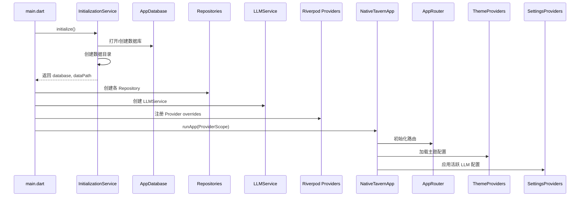
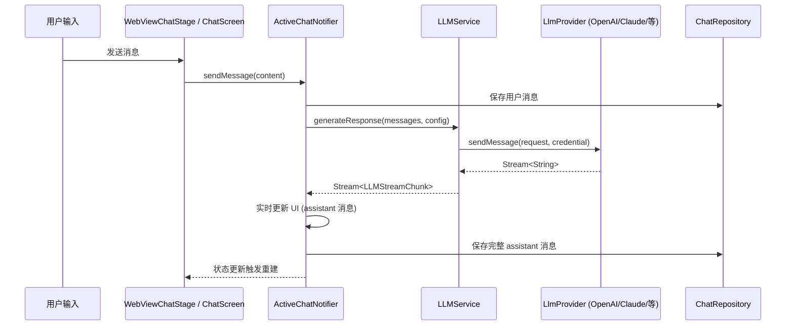
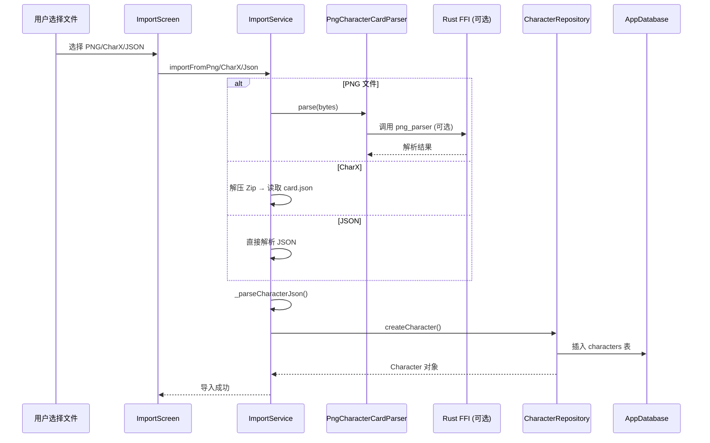

# KiraKira 项目架构与依赖分析报告

> **分析时间**：2026-01-20  
> **分析范围**：`lib/` 目录下 279 个 Dart 文件，约 60K 行代码  
> **项目版本**：0.4.17+2 (Flutter SDK >=3.16.0, Dart SDK >=3.2.0)

---

## 1. 项目概览

### 1.1 技术栈
| 类别 | 技术/库 | 版本 |
|------|---------|------|
| UI框架 | Flutter | >=3.16.0 |
| 状态管理 | flutter_riverpod / riverpod_annotation | ^2.4.9 / ^2.3.3 |
| 路由 | go_router | ^13.0.1 |
| 数据库 | drift + sqlite3_flutter_libs | ^2.14.1 / ^0.5.18 |
| 网络 | dio | ^5.4.0 |
| 本地推理 | onnxruntime | ^1.4.1 |
| 代码生成 | freezed, json_serializable, riverpod_generator, drift_dev, go_router_builder | 最新 |

### 1.2 代码规模统计
| 层级 | 文件数 | 代码行数 | 占比 |
|------|--------|----------|------|
| `lib/core/` | 6 | ~400 | 0.7% |
| `lib/data/` | 38 | ~13,500 | 22.5% |
| `lib/domain/` | 31 | ~8,200 | 13.7% |
| `lib/presentation/` | 168 | ~36,800 | 61.3% |
| `lib/services/` | 2 | ~60 | 0.1% |
| `lib/widgets/` | 2 | ~60 | 0.1% |
| `lib/l10n/` | 19 | ~1,200 | 2.0% |
| **总计** | **279** | **~60,200** | **100%** |

> 注：生成代码（`.g.dart`, `.freezed.dart`）占比约 40%，业务手写代码约 36K 行。

---

## 2. 分层架构分析

### 2.1 四层架构模型

```
┌─────────────────────────────────────────────────────────────┐
│                    Presentation Layer (UI)                   │
│  ┌─────────────┐ ┌─────────────┐ ┌─────────────┐ ┌────────┐ │
│  │   Screens   │ │  Widgets    │ │  Providers  │ │ Router │ │
│  │  (168 files)│ │  (20 files) │ │  (37 files) │ │(1 file)│ │
│  └─────────────┘ └─────────────┘ └─────────────┘ └────────┘ │
├─────────────────────────────────────────────────────────────┤
│                      Domain Layer (Business Logic)           │
│  ┌─────────────┐ ┌─────────────┐ ┌─────────────┐            │
│  │  Services   │ │  Providers  │ │   Models    │            │
│  │ (24 files)  │ │  (5 files)  │ │  (1 file)   │            │
│  └─────────────┘ └─────────────┘ └─────────────┘            │
├─────────────────────────────────────────────────────────────┤
│                       Data Layer (Persistence)               │
│  ┌─────────────┐ ┌─────────────┐ ┌─────────────┐            │
│  │ Repositories│ │  Database   │ │   Models    │            │
│  │ (9 files)   │ │ (2 files)   │ │ (30 files)  │            │
│  └─────────────┘ └─────────────┘ └─────────────┘            │
├─────────────────────────────────────────────────────────────┤
│                       Core Layer (Infrastructure)            │
│  ┌─────────────┐ ┌─────────────┐ ┌─────────────┐            │
│  │   Logger    │ │  Services   │ │   Utils     │            │
│  │ (3 files)   │ │ (1 file)    │ │ (1 file)    │            │
│  └─────────────┘ └─────────────┘ └─────────────┘            │
└─────────────────────────────────────────────────────────────┘
```

### 2.2 分层评价

| 维度 | 评价 | 说明 |
|------|------|------|
| **分层清晰度** | ⭐⭐⭐⭐⭐ | 四层边界分明，依赖方向单向（Presentation → Domain → Data → Core） |
| **关注点分离** | ⭐⭐⭐⭐ | UI、业务逻辑、数据持久化、基础设施分离良好 |
| **依赖倒置** | ⭐⭐⭐ | Domain 定义接口（如 `EJSRenderer`），Presentation 实现，符合 DIP |
| **跨层调用** | ⚠️ 存在 | 部分 Provider 直接引用 Repository/Service，可接受 |
| **循环依赖** | ✅ 无 | 未发现循环依赖 |

**结论**：架构分层清晰，符合 Clean Architecture 原则，便于测试和维护。

---

## 3. 模块依赖关系图

### 3.1 核心模块依赖图 (Mermaid)

```mermaid
graph TD
    %% Core Layer
    CoreLogger[core/logger] --> CoreUtils[core/utils]
    CoreServices[core/services/initialization_service] --> CoreLogger
    CoreServices --> CoreUtils
    CoreServices --> DataDatabase[Database]
    
    %% Data Layer - Database
    DataDatabase[Database] --> DataModels[Data Models]
    
    %% Data Layer - Repositories
    CharRepo[CharacterRepository] --> DataDatabase
    ChatRepo[ChatRepository] --> DataDatabase
    WorldRepo[WorldInfoRepository] --> DataDatabase
    PersonaRepo[PersonaRepository] --> DataDatabase
    GroupRepo[GroupRepository] --> DataDatabase
    TagRepo[TagRepository] --> DataDatabase
    LLMCfgRepo[LLMConfigRepository] --> DataDatabase
    ApiCredRepo[ApiCredentialRepository] --> DataDatabase
    BookmarkRepo[BookmarkRepository] --> DataDatabase
    
    %% Domain Layer - Providers (LLM)
    LLMPRegistry[LLMProviderRegistry] --> BaseProvider[LlmProvider]
    OpenAIProvider --> BaseProvider
    ClaudeProvider --> BaseProvider
    DeepSeekProvider --> BaseProvider
    CustomProvider --> BaseProvider
    
    %% Domain Layer - Services
    LLMService[LLMService] --> LLMPRegistry
    LLMService --> EJSRenderer[EJSRenderer Interface]
    ImportService[ImportService] --> PNGParser[PngCharacterCardParser]
    ImportService --> CharRepo
    ImportService --> WorldRepo
    EmbeddingService --> OnnxRuntime[ONNX Runtime]
    TokenizerService --> BGEModel[BGE Model]
    
    %% Presentation Layer - Providers (Riverpod)
    SettingsProviders[SettingsProviders] --> LLMService
    SettingsProviders --> ChatSummarizationService
    SettingsProviders --> TokenizerService
    SettingsProviders --> CharRepo
    SettingsProviders --> ChatRepo
    SettingsProviders --> WorldRepo
    SettingsProviders --> SharedPrefs
    
    ChatProviders[ChatProviders] --> SettingsProviders
    ChatProviders --> LLMService
    ChatProviders --> CharRepo
    ChatProviders --> ChatRepo
    ChatProviders --> PersonaRepo
    ChatProviders --> WorldInfoMatcher
    ChatProviders --> ChatSummarizationService
    ChatProviders --> VariablesService
    ChatProviders --> MacroService
    ChatProviders --> ImageGenService
    ChatProviders --> GroupProviders
    ChatProviders --> PersonaProviders
    ChatProviders --> PromptManagerProviders
    ChatProviders --> WorldInfoProviders
    ChatProviders --> VectorStorageProviders
    ChatProviders --> ImageGenProviders
    
    %% Other Presentation Providers
    CharProviders[CharacterProviders] --> CharRepo
    CharProviders --> TagProviders
    GroupProviders[GroupProviders] --> GroupRepo
    PersonaProviders[PersonaProviders] --> PersonaRepo
    WorldInfoProviders[WorldInfoProviders] --> WorldRepo
    TagProviders[TagProviders] --> TagRepo
    ThemeProviders[ThemeProviders] --> SharedPrefs
    PromptManagerProviders --> SharedPrefs
    AiPresetProviders --> SharedPrefs
    SpriteProviders --> CharRepo
    RegexProviders --> SharedPrefs
    TagProviders --> TagRepo
    StatsProviders --> ChatRepo
    FingerprintProviders --> CharRepo
    
    %% Presentation Layer - Screens (Major)
    AppRouter[AppRouter] --> SplashScreen
    AppRouter --> MainPage[MainPage + Shell]
    AppRouter --> HomeScreen
    AppRouter --> CharListScreen
    AppRouter --> CharDetailScreen
    AppRouter --> CharEditorScreen
    AppRouter --> ChatScreen[WebViewChatStage]
    AppRouter --> AISettingsScreen
    AppRouter --> SettingsScreen
    AppRouter --> WorldInfoScreen
    AppRouter --> GroupsScreen
    AppRouter --> PersonasScreen
    AppRouter --> TagsScreen
    AppRouter --> ImportScreen
    AppRouter --> 30+ Settings Screens
    
    %% Presentation Layer - Widgets
    ChatWidgets[Chat Widgets] --> LLMService
    ChatWidgets --> ChatProviders
    CharWidgets[Character Widgets] --> CharProviders
    CommonWidgets[Common Widgets] --> ThemeProviders
    
    %% Rust FFI (External)
    RustFFI[Rust FFI] -.-> PNGParser
    RustFFI -.-> CharXParser
    
    %% Platform Channels
    PlatformChannels[Platform Channels] -.-> TTSService
    PlatformChannels -.-> STTService
    PlatformChannels -.-> Live2DService
```

### 3.2 关键依赖路径

| 路径 | 说明 | 风险等级 |
|------|------|----------|
| `main.dart` → `AppDatabase` → `Repositories` → `LLMService` → `Providers` → `App` | 启动核心链 | 低 |
| `ChatScreen` → `ChatProviders` → `LLMService` → `LlmProvider` → `Dio` | 聊天消息发送 | 低 |
| `WebViewChatStage` → `JS Bridge` → `Flutter` → `ChatProviders` | WebView ↔ Flutter 双向通信 | 中 |
| `ImportScreen` → `ImportService` → `PNG Parser` → `Rust FFI` | 角色卡导入 | 中 |
| `SettingsScreen` → `SettingsProviders` → `SharedPreferences` / `Database` | 设置持久化 | 低 |

---

## 4. 核心调用链分析

### 4.1 启动初始化链



### 4.2 发送聊天消息链



### 4.3 角色导入链



---

## 5. 状态管理组件注册与使用

### 5.1 Riverpod Provider 分类统计

| 分类 | Provider 数量 | 代表文件 | 用途 |
|------|---------------|----------|------|
| **核心配置** | 5 | `settings_providers.dart` | LLM配置、主题、语言、共享偏好 |
| **聊天核心** | 12 | `chat_providers.dart` (3056行) | 活跃聊天、消息流、生成控制、变量、宏 |
| **角色管理** | 8 | `character_providers.dart` | 角色列表、筛选、收藏、详情 |
| **世界信息** | 6 | `world_info_providers.dart` | 知识库、条目、匹配器 |
| **人设系统** | 4 | `persona_providers.dart` | 用户人设 CRUD |
| **群聊系统** | 5 | `group_providers.dart` | 群组、成员、设置 |
| **标签系统** | 4 | `tag_providers.dart` | 标签 CRUD、角色关联 |
| **提示词管理** | 5 | `prompt_manager_providers.dart` | 预设、自定义提示词、排序 |
| **AI 预设** | 3 | `ai_preset_providers.dart` | 预设导入/导出/编辑 |
| **正则脚本** | 4 | `regex_providers.dart` | 脚本管理、测试、导入导出 |
| **精灵系统** | 3 | `sprite_providers.dart` | 情绪精灵、动作检测 |
| **统计分析** | 2 | `statistics_providers.dart` | 聊天统计、Token 用量 |
| **模型指纹** | 2 | `fingerprint_providers.dart` | 模型能力检测 |
| **TTS/STT** | 4 | `tts_providers.dart` + `stt_providers.dart` | 语音合成/识别 |
| **翻译** | 3 | `translation_providers.dart` | 多提供商翻译 |
| **图像生成** | 2 | `image_gen_providers.dart` | SD/DALL-E/ComfyUI 配置 |
| **变量系统** | 2 | `variables_providers.dart` | 全局/局部变量 |
| **向量存储** | 2 | `vector_storage_providers.dart` | RAG 向量库 |
| **其他** | 15+ | 各类 settings | Logit Bias, CFG, Tokenizer, MVU 等 |

**总计**：约 100+ Provider，全部基于 `flutter_riverpod`，大量使用 `StateNotifier` 和 `AutoDispose`。

### 5.2 Provider 注册模式

```dart
// 典型模式：在 main.dart 中通过 ProviderScope overrides 注入实例
final databaseProvider = Provider<AppDatabase>((ref) => throw UnimplementedError());
final characterRepositoryProvider = Provider<CharacterRepository>((ref) => throw UnimplementedError());

// main.dart
ProviderScope(
  overrides: [
    databaseProvider.overrideWithValue(database),
    characterRepositoryProvider.overrideWithValue(characterRepo),
    llmServiceProvider.overrideWithValue(llmService),
    // ...
  ],
  child: const NativeTavernApp(),
)
```

**优点**：依赖注入清晰，便于测试（可替换为 Mock）。
**缺点**：`main.dart` 耦合度高，所有实例创建集中在入口。

---

## 6. 孤岛文件识别

通过分析 import 关系，识别出以下可能的孤岛文件（被 import 但无实际调用，或从未被 import）：

| 文件路径 | 类型 | 疑似原因 | 风险等级 |
|----------|------|----------|----------|
| `lib/presentation/screens/placeholder/placeholder_screen.dart` (15行) | Screen | 占位页面，路由表中无引用 | 🟢 低 |
| `lib/presentation/widgets/无标题-1.txt` | 非代码 | 疑似误放文件 | 🟢 低 |
| `lib/services/live2d_service.dart` (23行) | Service | 仅导出类，未见实际使用 | 🟡 中 |
| `lib/widgets/live2d_webview.dart` (36行) | Widget | 同上 | 🟡 中 |
| `lib/presentation/widgets/chat/widgets/chat_app_bar.dart` (9行) | Widget | 仅导出类，极短 | 🟡 中 |
| `lib/presentation/widgets/chat/widgets/chat_empty_view.dart` (8行) | Widget | 同上 | 🟡 中 |
| `lib/presentation/widgets/chat/widgets/chat_input_bar.dart` (65行) | Widget | 同上 | 🟡 中 |
| `lib/presentation/widgets/chat/widgets/chat_message_list.dart` (8行) | Widget | 同上 | 🟡 中 |
| `lib/presentation/shell/tabs/*.dart` (4个文件，各7-54行) | Tab Shell | 极简导出，可能被动态 import | 🟡 中 |

> **说明**：标记为 🟡 中风险的文件，可能通过字符串路由、反射或动态 import 使用，建议人工确认后再清理。

---

## 7. 关键设计模式识别

| 模式 | 实现位置 | 说明 |
|------|----------|------|
| **Repository Pattern** | `lib/data/repositories/` | 9个 Repository 封装数据库操作 |
| **Provider/Registry Pattern** | `lib/domain/providers/llm_provider_registry.dart` | LLM 提供商动态注册 |
| **StateNotifier Pattern** | 所有 `*_providers.dart` | Riverpod 状态管理核心 |
| **Factory Pattern** | `ImportService._parseCharacterJson()` | 根据 JSON 格式创建 Character |
| **Strategy Pattern** | `LlmProvider` 子类 | 不同 LLM API 适配策略 |
| **Observer Pattern** | `ChatProviders` + `ref.listen` | 设置变更监听、日志捕获 |
| **Bridge Pattern** | `WebViewChatStage` + `chat_bridge.dart` | Flutter ↔ WebView 双向通信 |
| **Command Pattern** | `SlashCommandService` | 斜杠命令解析执行 |

---

## 8. 外部依赖与平台集成

| 集成点 | 实现方式 | 文件 |
|--------|----------|------|
| **Rust FFI** | `flutter_rust_bridge` / `dart:ffi` | `rust/src/png_parser.rs`, `charx_parser.rs` |
| **WebView** | `flutter_inappwebview` | `webview_chat_stage.dart`, `chat_bridge.dart` |
| **TTS** | `flutter_tts` + 系统/云端 | `tts_service.dart` |
| **STT** | 系统/Whisper/Azure | `stt_service.dart` |
| **Live2D** | WebView 加载本地 HTML | `live2d_webview.dart`, `live2d_service.dart` |
| **ONNX 推理** | `onnxruntime` | `embedding_service.dart`, `bge_tokenizer.dart` |
| **文件系统** | `path_provider`, `file_picker` | 多处 |
| **分享/打开链接** | `share_plus`, `url_launcher` | 多处 |

---

## 9. 总结与建议

### 9.1 架构优势
1. **分层清晰**：四层架构边界分明，依赖方向单一
2. **状态管理成熟**：Riverpod 使用规范，Provider 粒度适中
3. **数据库设计完善**：Drift 类型安全，迁移策略完备（15 个版本）
4. **扩展性强**：LLM Provider 注册表、导入服务均支持插件化扩展
5. **跨平台支持**：iOS/Android/Web/Desktop 统一代码库

### 9.2 潜在改进点
1. **`main.dart` 过重**：180+ 行初始化代码，建议拆分为 `InitializationModule` 类
2. **Provider 注册分散**：37 个 provider 文件，缺乏统一索引文档
3. **WebView 耦合度高**：`webview_chat_stage.dart` 4356 行，承担过多职责
4. **生成代码占比大**：`.g.dart/.freezed.dart` 占 40%，构建耗时较长
5. **孤岛文件清理**：建议确认并清理 10 个疑似无用文件

### 9.3 给第二阶段的建议
- **P0**：拆分 `webview_chat_stage.dart`，提取 Bridge、消息渲染、输入处理为独立模块
- **P1**：建立 Provider 注册清单文档，梳理依赖图
- **P2**：评估是否将部分 Rust 逻辑迁移至 Dart，减少 FFI 复杂度
- **P3**：清理孤岛文件，建立代码所有权机制

---

## 附录：文件清单统计

详见 `DiaoYan/file_lines.txt` 完整列表。