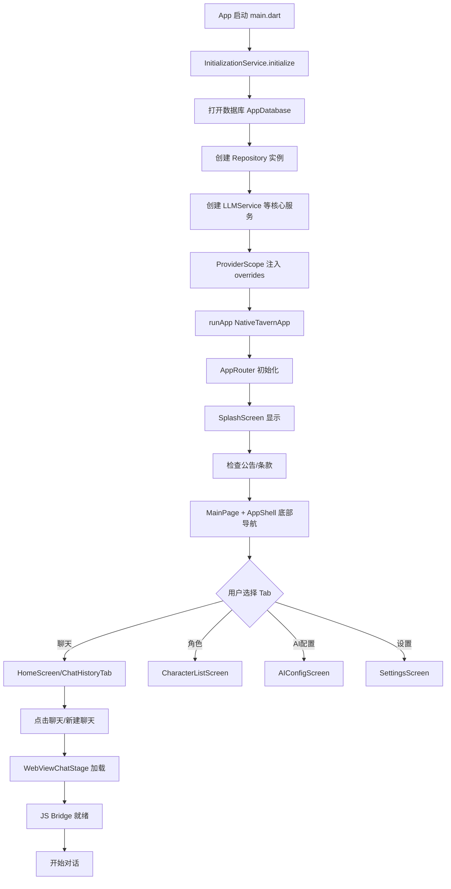
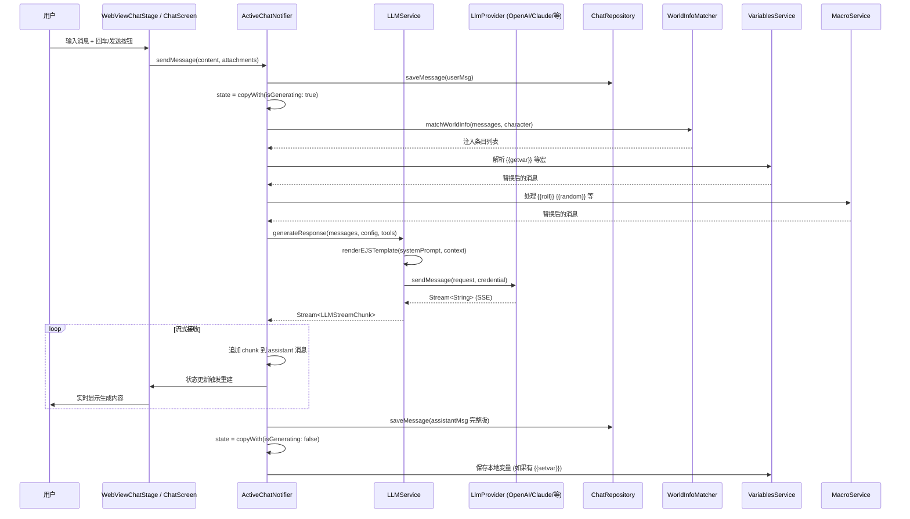
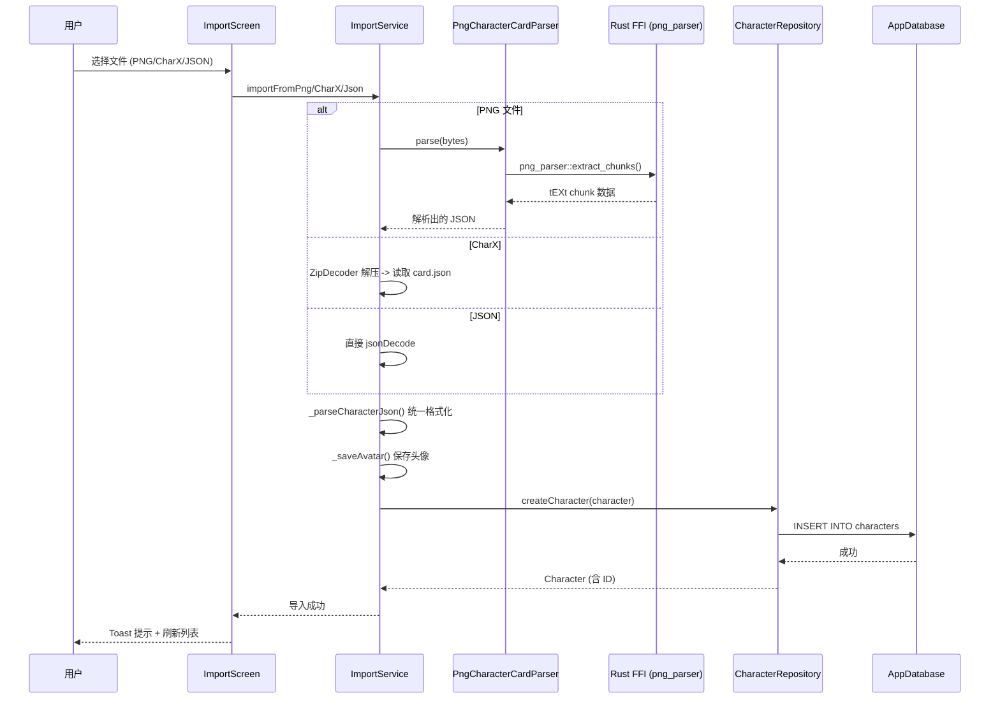
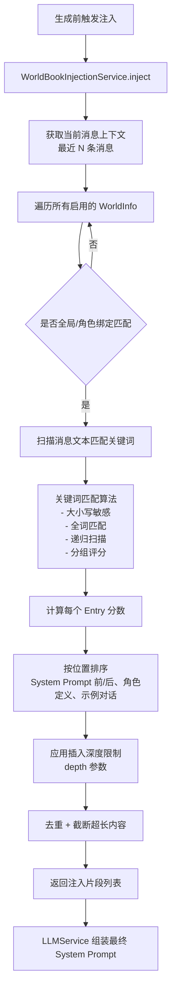
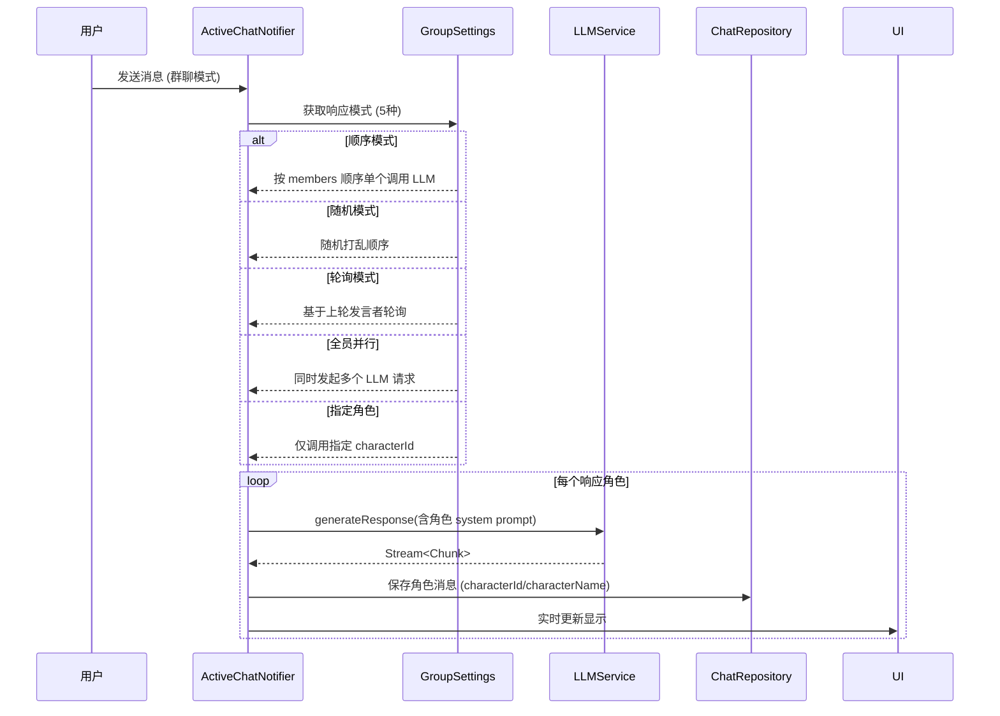
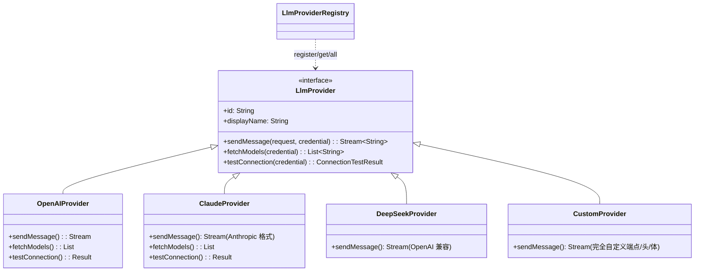

# KiraKira 核心业务流程与业务逻辑分析报告

> **分析时间**：2026-01-20  
> **分析范围**：核心用户操作流、关键业务流程、数据流向、持久化机制、外部交互、错误处理、配置管理  
> **分析方法**：代码追踪、序列图构建、状态流转分析

---

## 1. 用户核心操作流

### 1.1 启动 → 首页 → 功能页完整流程



### 1.2 关键页面导航树

```
/ (Splash)
├── / (MainPage Shell)
│   ├── /chats (HomeScreen - 聊天列表/历史)
│   │   └── /chat/:id (WebViewChatStage - 聊天界面)
│   ├── /home (MainPage - 主页/仪表盘)
│   ├── /characters (CharacterListScreen - 角色列表)
│   │   ├── /characters/:id (CharacterDetailScreen - 角色详情)
│   │   ├── /characters/new (CharacterEditorScreen - 新建角色)
│   │   ├── /characters/:id/edit (CharacterEditorScreen - 编辑角色)
│   │   ├── /characters/:id/regex (CharacterRegexScreen - 角色正则)
│   │   └── /characters/:id/sprites (CharacterSpritesScreen - 精灵管理)
│   ├── /ai-config (AIConfigScreen - AI配置)
│   │   ├── /llm-config-list (LlmConfigListScreen)
│   │   ├── /llm-test (LlmTestScreen)
│   │   └── /model-detection (ModelDetectionScreen)
│   └── /settings (SettingsScreen - 设置入口)
│       ├── /prompt-manager (PromptManagerScreen)
│       ├── /advanced-settings (AdvancedSettingsScreen)
│       ├── /theme-settings (ThemeSettingsScreen)
│       ├── /background-settings (BackgroundSettingsScreen)
│       ├── /ai-presets (AIPresetsScreen)
│       ├── /sprite-settings (SpriteSettingsScreen)
│       ├── /tts-settings (TTSSettingsScreen)
│       ├── /stt-settings (STTSettingsScreen)
│       ├── /translation-settings (TranslationSettingsScreen)
│       ├── /image-gen-settings (ImageGenSettingsScreen)
│       ├── /regex-settings (RegexSettingsScreen)
│       ├── /variables-settings (VariablesSettingsScreen)
│       ├── /vector-storage-settings (VectorStorageSettingsScreen)
│       ├── /statistics (StatisticsScreen)
│       ├── /logit-bias-settings (LogitBiasSettingsScreen)
│       ├── /cfg-scale-settings (CFGScaleSettingsScreen)
│       ├── /mvu-settings (MvuSettingsScreen)
│       ├── /tokenizer-settings (TokenizerSettingsScreen)
│       └── /geek-dashboard (GeekDashboardScreen)
├── /world-info (WorldInfoScreen - 世界信息/知识库)
├── /groups (GroupsScreen - 群聊)
│   └── /groups/:id (GroupDetailScreen)
├── /personas (PersonasScreen - 人设)
│   └── /personas/edit (PersonaEditorScreen)
├── /tags (TagsScreen - 标签)
├── /import (ImportScreen - 导入)
└── /webview-stage/:id (WebViewChatStage - 独立聊天页)
```

---

## 2. 关键业务流程详解

### 2.1 发送聊天消息流程 (核心)



**关键数据结构**：
- `ActiveChatState` - 聊天会话状态（消息、生成中标志、当前角色/群组、变量等）
- `ChatMessage` - 单条消息（角色、内容、swipes、推理内容、附件、metadata）
- `LLMConfig` - 模型参数（temperature、top_p、max_tokens、采样器等 20+ 参数）

### 2.2 角色导入/导出流程



**支持格式**：
- **PNG V2/V3** - tEXt chunk 嵌入 `chara` 基64 JSON
- **CharX (V3 规范)** - Zip 包含 `card.json` + `avatar.png` + 资源文件
- **JSON** - SillyTavern V2/V3 格式、原生格式

**导出对称性**：`exportToPng`、`exportToCharX`、`exportToJson`

### 2.3 世界信息/知识库注入流程



**核心匹配逻辑** (`world_book_injection_service.dart`)：
- 关键词数组 `keys` + `secondaryKeys`
- 位置 `position`: 0=系统前、1=系统后、2=角色定义、3=示例、4=作者注释
- 递归深度 `recursionDepth` 防止循环引用
- 分组评分 `useGroupScoring` + `groupWeight`

### 2.4 群聊多角色响应流程



**5种响应模式**：`sequential`、`random`、`round_robin`、`parallel`、`specific`

### 2.5 提示词管理与构建流程

```mermaid
flowchart TD
    A[PromptManagerService.buildPrompt] --> B[获取启用的预设 prompts]
    B --> C[按 prompt_order 排序]
    C --> D[遍历每个 PromptSection]
    D --> E{角色支持检查<br/>section.character == currentChar}
    E -->|否| D
    E -->|是| F[渲染 EJS 模板<br/>可用变量: user, char, messages...]
    F --> G[按 depth 注入<br/>插入到 messages[depth]]
    G --> D
    D --> H[返回最终 messages 数组]
```

**关键特性**：
- `PromptSection`: `role` (system/user/assistant)、`content` (EJS 模板)、`depth`、启用/禁用、角色过滤
- 支持 SillyTavern 预设导入 (`prompts` + `prompt_order`)
- 自定义 Section 支持角色级别覆盖

### 2.6 表情精灵情绪检测流程

```mermaid
flowchart TD
    A[新消息到达] --> B[SpriteService.detectEmotion]
    B --> C[规则匹配: 关键词/正则/动作标记]
    C --> D[情绪评分: happy/sad/angry/surprised/fear/... 15种]
    D --> E[选择最高分情绪]
    E --> F[查找角色精灵文件夹<br/>assets/live2d/{charId}/{emotion}.png]
    F --> G{文件存在?}
    G -->|是| H[SpriteDisplay 显示<br/>fadeIn + scale 动画]
    G -->|否| I[使用默认/隐藏]
    H --> J[transitionDurationMs 后淡出]
```

**15种情绪**：happy, sad, angry, surprised, fearful, disgusted, neutral, embarrassed, loving, confident, confused, sleepy, playful, thoughtful, determined

---

## 3. 数据流向总览

```
┌─────────────┐     ┌──────────────────┐     ┌─────────────────┐
│    UI       │────▶│  Riverpod Provider │────▶│  Domain Service │
│ (Screen/    │     │ (StateNotifier)   │     │ (LLMService,    │
│  Widget)    │     │                   │     │  ImportService, │
└─────────────┘     └────────┬─────────┘     │  WorldBookInj...)│
                             │                └────────┬────────┘
                             ▼                         ▼
                    ┌──────────────────┐     ┌─────────────────┐
                    │   Repository     │     │  External API   │
                    │ (Char/Chat/      │     │ (OpenAI, Claude,│
                    │  World/Group)    │     │  ElevenLabs...) │
                    └────────┬─────────┘     └─────────────────┘
                             │
                             ▼
                    ┌──────────────────┐
                    │   Drift Database │
                    │ (SQLite + WAL)   │
                    └──────────────────┘
                             │
              ┌──────────────┼──────────────┐
              ▼              ▼              ▼
        ┌──────────┐  ┌──────────┐  ┌──────────┐
        │ Shared   │  │  File    │  │  Rust    │
        │Preferences│  │  System  │  │  FFI     │
        └──────────┘  └──────────┘  └──────────┘
```

**数据流向原则**：
1. **单向流**：UI → Provider → Service → Repository → DB
2. **反向通知**：DB 变更 → Repository Stream → Provider 更新 → UI 重建
3. **外部调用**：Service → HTTP Client (Dio) → 外部 API → 解析 → 返回 Domain 对象

---

## 4. 持久化机制详解

### 4.1 数据库 Schema (Drift + SQLite)

| 表名 | 核心字段 | 索引/外键 | 用途 |
|------|----------|-----------|------|
| `characters` | id(PK), name, description, personality, avatarPath, characterBookJson, tags, isFavorite | PK(id), FK 无 | 角色卡存储 |
| `chats` | id(PK), characterId(FK), groupId(FK), title, settingsJson, authorNote, authorNoteDepth | PK(id), FK→characters/groups | 会话元数据 |
| `messages` | id(PK), chatId(FK), role, content, swipesJson, characterId, attachmentsJson, swipesDataJson | PK(id), FK→chats | 消息历史 |
| `world_infos` | id(PK), name, enabled, isGlobal, characterId(FK), scanDepth, recursionDepth | PK(id), FK→characters | 知识库 |
| `world_info_entries` | id(PK), worldInfoId(FK), keys, content, position, depth, group, probability | PK(id), FK→world_infos | 知识条目 |
| `llm_configs` | id(PK), name, provider, endpoint, apiKey, model, defaultSettingsJson, isDefault | PK(id) | LLM 配置 |
| `personas` | id(PK), name, description, avatarPath, isDefault | PK(id) | 用户人设 |
| `groups` | id(PK), name, membersJson, settingsJson, avatarPath | PK(id) | 群聊 |
| `bookmarks` | id(PK), chatId(FK), messageId, messageIndex, name | PK(id), FK→chats | 书签/分支 |
| `tags` | id(PK), name, color, icon | PK(id) | 角色标签 |
| `character_tags` | characterId(FK), tagId(FK) | PK(characterId,tagId) | 多对多 |
| `global_states` | key(PK), value, updatedAt | PK(key) | 设置/缓存 KV |
| `vector_collections` | id(PK), name, dimensions | PK(id) | RAG 集合 |
| `vector_documents` | id(PK), collectionId, content, embedding, metadataJson | PK(id) | RAG 文档 |

**迁移策略**：15 个版本，`onUpgrade` 增量添加列/表，`PRAGMA journal_mode=WAL` + `synchronous=FULL`

### 4.2 SharedPreferences 使用

| Key 前缀 | 存储内容 | 迁移状态 |
|----------|----------|----------|
| `llm_config` | 旧版单配置 LLM 设置 | → `global_states` 迁移中 |
| `llm_provider_config_*` | 各 Provider 连接配置 | → `global_states` 迁移中 |
| `theme_mode` | 深色/浅色/跟随系统 | 保留 |
| `locale` | 语言设置 | 保留 |
| `variables_<chatId>` | 聊天局部变量 | 保留 |

### 4.3 文件系统存储

| 目录 | 内容 | 清理策略 |
|------|------|----------|
| `{appDir}/KiraKira/avatars/` | 角色头像图片 | 角色删除时级联清理 |
| `{appDir}/KiraKira/backgrounds/` | 聊天背景图 | 手动清理 |
| `{appDir}/KiraKira/sprites/{charId}/` | 精灵图片 (15情绪×多帧) | 角色删除时清理 |
| `{appDir}/KiraKira/backups/` | 自动/手动备份 (JSON/JSONL) | 保留策略：小时/天/周可配 |
| `{appDir}/KiraKira/database.sqlite` | Drift 数据库 | WAL 模式自动检查点 |

---

## 5. 外部交互集成

### 5.1 WebView 双向桥接 (`chat_bridge.dart` + `chat_bridge_js.dart`)

| 方向 | 方法 | Payload 示例 | 用途 |
|------|------|--------------|------|
| Flutter → JS | `sendMessage(text)` | `{type: 'send', payload: 'hello'}` | 发送用户输入 |
| Flutter → JS | `updateMessages(msgs)` | `{type: 'messages', payload: [...]}` | 全量同步消息 |
| Flutter → JS | `setGenerating(bool)` | `{type: 'generating', payload: true}` | 控制生成状态显示 |
| Flutter → JS | `triggerImageGen(prompt)` | `{type: 'imageGen', payload: {...}}` | 触发生图 |
| JS → Flutter | `onUserSend(text)` | `window.flutter_inappwebview.callHandler('onUserSend', text)` | 用户发送消息 |
| JS → Flutter | `onSwipe(index)` | `callHandler('onSwipe', index)` | 切换 swipe |
| JS → Flutter | `onEditMessage(id, text)` | `callHandler('onEdit', {id, text})` | 编辑消息 |
| JS → Flutter | `onRegenerate(id)` | `callHandler('onRegenerate', id)` | 重新生成 |
| JS → Flutter | `onImageGenPrompt(prompt)` | `callHandler('onImageGen', prompt)` | 请求生图 |

**桥接实现**：`InAppWebView` + `JavaScriptHandler` + `evaluateJavascript`

### 5.2 LLM Provider 适配层



**统一请求格式**：`LlmRequest` (messages, temperature, maxTokens, topP, model, extraParams)
**统一响应格式**：`LLMStreamChunk` (content?, reasoning?, isReasoningChunk)

### 5.3 TTS/STT 多提供商

| 服务 | 提供商 | 实现文件 |
|------|--------|----------|
| TTS | System (flutter_tts)、ElevenLabs、Azure | `tts_service.dart` |
| STT | System、Whisper (本地/云)、Azure | `stt_service.dart` |

**共同接口**：`speak(text, voiceConfig)` / `listen(onResult, onError)` + 队列管理

### 5.4 图像生成集成

| 提供商 | API 兼容性 | 配置项 |
|--------|------------|--------|
| Stable Diffusion | Automatic1111 / ComfyUI | steps, cfg_scale, sampler, size, negative_prompt |
| DALL-E 2/3 | OpenAI 官方 | size, quality, style |
| Custom | 自定义端点 | 完全自定义 |

---

## 6. 错误处理机制

### 6.1 分层错误处理

| 层级 | 处理方式 | 示例 |
|------|----------|------|
| **UI 层** | `try-catch` + `SnackBar`/Dialog 提示 | `chat_screen.dart` 发送失败提示 |
| **Provider 层** | `state = copyWith(error: msg)` + 记录日志 | `ActiveChatNotifier` 生成异常捕获 |
| **Service 层** | 结构化错误类型 + 重试策略 | `LLMService` 网络错误重试 3 次 |
| **Repository 层** | Drift 事务 + 异常转换 | `CharacterRepository` 违反唯一约束转为业务异常 |
| **全局** | `FlutterError.onError` + `KiraLogger` | `main.dart` L12-13 |

### 6.2 关键错误码映射

| 场景 | 内部错误类型 | 用户可见提示 |
|------|--------------|--------------|
| 网络超时 | `DioException.connectionTimeout` | "连接超时，请检查网络" |
| API Key 无效 | `LLMProvider` 返回 401 | "API Key 无效或已过期" |
| 上下文过长 | `LLMProvider` 返回 400 context_length | "对话过长，请开启自动摘要或清理历史" |
| WebView 崩溃 | `PlatformException` | "聊天界面异常，正在恢复..." |
| 导入格式错误 | `FormatException` / 自定义 | "文件格式不支持或已损坏" |

### 6.3 日志系统 (`core/logger/`)

- `KiraLogger` - 单例，支持标签分类 (FLUTTER, LLM, DB, BRIDGE, UI...)
- `LogStorage` - 持久化到文件，支持轮转、查询、导出
- `DebugLogOverlay` - 悬浮球实时查看日志 (开发/调试模式)

---

## 7. 配置与常量管理

### 7.1 环境配置

| 配置项 | 来源 | 优先级 | 说明 |
|--------|------|--------|------|
| LLM 配置 | `llm_configs` 表 + `global_states` | DB > SharedPrefs | 多配置切换、默认配置 |
| 主题配置 | `shared_preferences` | SP | 深色/浅色/自定义 18 套主题 |
| 应用设置 | `AppSettings` (Riverpod + SP) | SP | 100+ 设置项 |
| 语言 | `localeProvider` + SP | SP | 仅中文 (l10n 预留扩展) |

### 7.2 全局常量

| 常量 | 定义位置 | 用途 |
|------|----------|------|
| `AppTheme.primaryColor` 等 | `app_theme.dart` | 设计系统色值 |
| `GlassDesign.*` | `glass_container.dart` | 毛玻璃系统参数 |
| `AppRoutes.*` | `app_router.dart` | 路由路径常量 |
| `LLMProvider.*` | `llm_service.dart` | Provider 枚举 |
| `MessageRole.*` | `message.dart` | user/assistant/system |

### 7.3 宏系统变量 (`{{}}` 语法)

| 宏 | 解析服务 | 示例 |
|----|----------|------|
| `{{user}}` / `{{char}}` | `MacroService` | 当前人设/角色名 |
| `{{time}}` / `{{date}}` | `MacroService` | 当前时间/日期 |
| `{{random:min:max}}` | `MacroService` | 随机数 |
| `{{roll:NdM}}` | `MacroService` | 掷骰子 |
| `{{getvar:name}}` | `VariablesService` | 读取变量 |
| `{{setvar:name:value}}` | `VariablesService` | 写入变量 |
| `{{lastMessage}}` | `MacroService` | 最后一条消息 |

---

## 8. 核心类职责矩阵

| 类/服务 | 核心职责 | 依赖 | 被依赖 |
|---------|----------|------|--------|
| `LLMService` | LLM 统一网关、流式处理、工具调用、摘要 | LlmProviderRegistry, EJSRenderer | ActiveChatNotifier, ImageGenService |
| `ActiveChatNotifier` | 聊天会话状态机、生成控制、变量/宏/世界书协调 | LLMService, Repositories, WorldBookInjectionService | WebViewChatStage, ChatScreen |
| `ImportService` | 角色卡多格式解析、头像提取、持久化 | PngCharacterCardParser, CharacterRepository | ImportScreen |
| `WorldBookInjectionService` | 关键词匹配、分组评分、递归注入、位置插入 | WorldInfoRepository | ActiveChatNotifier |
| `VariablesService` | 全局/局部变量存储、宏解析支持 | SharedPreferences | ActiveChatNotifier, MacroService |
| `ChatRepository` | 消息/会话 CRUD、流式保存、书签 | AppDatabase | ActiveChatNotifier, ChatProviders |
| `CharacterRepository` | 角色 CRUD、收藏、标签、头像 | AppDatabase | ImportService, ActiveChatNotifier, CharacterProviders |
| `PngCharacterCardParser` | PNG tEXt chunk 解析、CharX 规范支持 | Rust FFI (可选) | ImportService |

---

## 9. 业务规则与边界条件

| 规则 | 实现位置 | 边界条件 |
|------|----------|----------|
| 单聊天最大消息数 | `ChatRepository` / `ActiveChatNotifier` | 无硬限制，依赖自动摘要 |
| 世界信息最大递归深度 | `WorldBookInjectionService` | `recursionDepth` 默认 4，可配置 |
| 变量名长度/值大小 | `VariablesService` | 键 100 字符，值 10KB |
| 正则脚本最大匹配次数 | `RegexService` | 单条消息单脚本最多 100 次替换 |
| 书签最大数/聊天 | `BookmarkRepository` | 无限制 |
| 群聊最大成员数 | `GroupSettings` | 默认 10，可配置 |
| 导入文件大小限制 | `ImportScreen` | 10MB (前端限制) |
| 流式生成最大 Token | `LLMConfig.maxTokens` | 默认 8192，模型上限为准 |

---

## 10. 总结

KiraKira 的核心业务逻辑围绕 **“角色驱动的多模态 AI 对话”** 展开，主要业务闭环：

1. **角色管理** → 导入/创建/编辑/标签/精灵 → 角色卡持久化
2. **会话管理** → 新建/切换/书签/分支/背景 → 会话元数据持久化
3. **消息生成** → 上下文构建(世界书/变量/宏/提示词) → LLM 流式生成 → 持久化
4. **多模态交互** → 文本/语音/图像/表情精灵/Markdown/HTML 渲染
5. **高级控制** → 采样器/正则/指纹检测/RAG/向量存储/自动摘要

**架构特点**：
- Riverpod 单向数据流 + 状态机模式
- 领域服务无 UI 依赖，便于测试
- Drift 类型安全数据库 + 完整迁移
- 多提供商抽象层 (LLM/TTS/STT/ImageGen/翻译)
- WebView 混合渲染承载复杂富文本交互

**主要技术债**：见任务 8 报告。