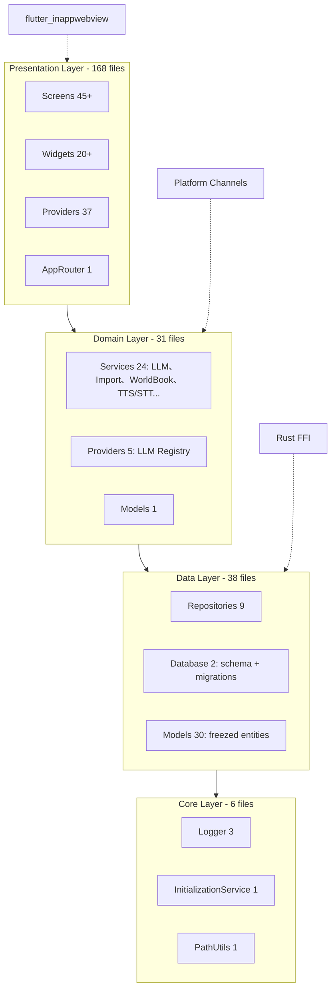
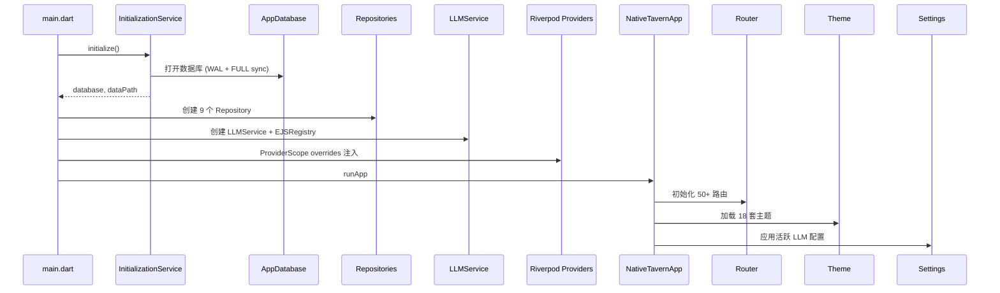

# KiraKira 项目深度调研总结报告

> **调研时间**：2026-01-20  
> **调研范围**：`lib/` 目录 279 个 Dart 文件，约 60K 行代码（含生成代码）  
> **调研模式**：只读静态分析，零代码修改  
> **输出报告**：9 份专题分析报告

---

## 1. 项目概况

### 1.1 基本信息
| 项目属性 | 详情 |
|----------|------|
| **项目名称** | KiraKira (Native Tavern) |
| **版本** | 0.4.17+2 |
| **定位** | 原生跨平台移动应用（iOS/Android），SillyTavern 原生重写 |
| **技术栈** | Flutter 3.16+、Dart 3.2+、Riverpod、GoRouter、Drift/SQLite、Dio、ONNX Runtime |
| **代码规模** | 279 文件、~60K 行（手写 ~36K 行、生成 ~24K 行） |
| **架构模式** | Clean Architecture 四层 + Riverpod 单向数据流 |
| **核心特性** | 多提供商 LLM、角色卡全格式兼容、流式对话、世界书、群聊、TTS/STT、翻译、生图、RAG、正则脚本、变量/宏系统 |

### 1.2 代码分布
```
lib/
├── core/           6 文件   (基础设施: Logger、初始化、路径工具)
├── data/          38 文件  (数据层: Database、Models、Repositories)
├── domain/        31 文件  (领域层: LLM Provider、Services、Models)
├── presentation/ 168 文件  (表现层: Screens、Widgets、Providers、Router、Theme)
├── services/      2 文件   (Live2D 相关)
├── widgets/       2 文件   (Live2D WebView)
└── l10n/         19 文件   (国际化: 17 语言 ARB 文件)
```

### 1.3 核心依赖
| 类别 | 关键依赖 | 版本 |
|------|----------|------|
| 状态管理 | flutter_riverpod, riverpod_annotation | ^2.4.9, ^2.3.3 |
| 路由 | go_router | ^13.0.1 |
| 数据库 | drift, sqlite3_flutter_libs | ^2.14.1, ^0.5.18 |
| 网络 | dio | ^5.4.0 |
| 本地推理 | onnxruntime | ^1.4.1 |
| WebView | flutter_inappwebview | ^6.0.0 |
| 代码生成 | freezed, json_serializable, riverpod_generator, drift_dev, go_router_builder | 最新 |

---

## 2. 架构总览

### 2.1 四层架构图



### 2.2 核心调用链



### 2.3 状态管理架构
- **约 100+ Provider** 基于 `flutter_riverpod`
- **核心 Provider**：`ActiveChatNotifier` (3056行)、`SettingsProviders` (1082行)、`CharacterProviders`、`WorldInfoProviders` 等
- **模式**：`StateNotifier` + `AutoDispose` + `ProviderScope overrides` 依赖注入
- **数据流**：UI → Provider → Service → Repository → Database → 反向通知

---

## 3. 核心业务流程

| 业务域 | 核心流程 | 关键组件 |
|--------|----------|----------|
| **聊天对话** | 输入 → 上下文构建(世界书/变量/宏/提示词) → LLM 流式生成 → 持久化 | `ActiveChatNotifier`、`LLMService`、`WorldBookInjectionService` |
| **角色管理** | PNG/CharX/JSON 导入 → 解析 → 头像提取 → 入库 | `ImportService`、`PngCharacterCardParser`、`CharacterRepository` |
| **世界信息** | 关键词扫描 → 分组评分 → 递归注入 → 位置插入 | `WorldBookInjectionService`、`WorldInfoRepository` |
| **群聊** | 5种响应模式 → 并行/串行调用 LLM → 角色标识持久化 | `GroupSettings`、`ActiveChatNotifier` |
| **多模态** | TTS/STT/翻译/生图/精灵情绪 → 多提供商抽象层 | `TTSService`、`STTService`、`ImageGenerationService`、`SpriteService` |
| **高级控制** | 采样器全参数 / 正则脚本 / 指纹检测 / RAG / 自动摘要 | `LLMConfig`、`RegexService`、`VectorStorageService` |

---

## 4. 主要风险点 Top 10

| 排名 | 风险 | 类别 | 严重度 | 影响 | 所在报告 |
|------|------|------|--------|------|----------|
| **1** | `webview_chat_stage.dart` 4356 行神类，每 token `setState` 全页重建 | 性能/架构 | 🔴 致命 | 聊天掉帧、内存高、维护极难 | 任务 1, 4 |
| **2** | `chat_providers.dart` 3056 行巨型 Provider，状态更新波及面过广 | 架构/稳定性 | 🔴 致命 | 竞态条件、不必要重建、测试困难 | 任务 1, 4, 5 |
| **3** | 5 个 `AnimationController` 缺失 `dispose` (WebView、STT、Reasoning、Sprite、Typing) | 内存泄漏 | 🔴 致命 | 长期运行内存增长、OOM 风险 | 任务 4, 6 |
| **4** | 同步 I/O `readAsBytesSync` 在主线程 (3 处) | 性能 | 🔴 致命 | 大文件导入/编码阻塞 UI、ANR | 任务 4 |
| **5** | 20+ 处强制解包 `!`/`as` 无保护 | 空安全 | 🔴 致命 | 运行时崩溃、生产事故 | 任务 5 |
| **6** | 双设计系统并存 (AppTheme + GlassContainer)，色系/圆角/阴影不统一 | UI 一致性 | 🔴 致命 | 视觉割裂、维护成本高 | 任务 3 |
| **7** | `llm_service.dart` 2046 行混合 10+ 职责 | 架构 | 🟠 严重 | 单一职责违背、编译慢、扩展难 | 任务 1, 4 |
| **8** | 世界书关键词匹配 O(n×m) 双重循环，无索引 | 算法性能 | 🟠 严重 | 长上下文/大知识库时注入延迟高 | 任务 4 |
| **9** | WebView↔Flutter 桥接无错误边界/超时/类型校验 | 稳定性 | 🟠 严重 | JS 错误导致静默失败、消息丢失 | 任务 5 |
| **10** | 异步竞态：`_generationToken` 共享导致取消/生成错乱 | 逻辑 Bug | 🟠 严重 | 快速切换聊天时生成中断/幽灵消息 | 任务 5 |

---

## 5. 第二阶段改进建议优先级

### P0 - 立即止血 (Week 1-4，~3 周)
| 任务 | 说明 | 预计工时 |
|------|------|----------|
| P0-1 | 为所有 `AnimationController`/`Timer` 添加 `dispose` | 0.5 天 |
| P0-2 | 同步 I/O 全部迁移至 `compute`/isolate | 0.5 天 |
| P0-3 | 关键 `!`/`as` 加非空判断或 `try-catch` | 1 天 |
| P0-4 | 删除 `placeholder_screen.dart`、`无标题-1.txt` | 0.1 天 |
| P0-5 | WebView Bridge 封装错误边界、超时重试 | 1 天 |
| P0-6 | 启动 `webview_chat_stage.dart` 拆分重构 (Bridge/MessageList/InputBar/Controller) | 3-5 天 |
| P0-7 | 启动 `chat_providers.dart` 拆分 (MessageManager/GenerationController/ContextBuilder) | 2-3 天 |
| P0-8 | 建立 `DesignTokens` 统一设计系统，合并 GlassContainer | 3-5 天 |

### P1 - 核心重构 (Week 5-12，~6-8 周)
| 任务 | 说明 | 预计工时 |
|------|------|----------|
| P1-1 | 完成 `webview_chat_stage.dart` 拆分 (目标 < 800 行/文件) | 5 天 |
| P1-2 | 完成 `chat_providers.dart` 拆分 (目标 < 800 行/文件) | 5 天 |
| P1-3 | 拆分 `llm_service.dart` (TemplateRenderer/StreamHandler/ProviderAdapter/Summarizer) | 5 天 |
| P1-4 | 提取 `InitializationModule` 精简 `main.dart` | 2 天 |
| P1-5 | 建立 Provider 注册清单文档 (`providers_registry.dart`) | 2 天 |
| P1-6 | 世界书注入算法优化：Trie 树/AC 自动机 | 3-5 天 |
| P1-7 | 重构 Generation Token 机制解决竞态 | 2 天 |
| P1-8 | 统一色系/圆角/间距/字体到 DesignTokens，全量替换硬编码 | 5 天 |
| P1-9 | WebView 内嵌 CSS 变量构建时同步 DesignTokens | 2 天 |
| P1-10 | 清理 `character_list_screen.dart` 废弃 View 类 | 1 天 |

### P2 - 质量提升 (Week 13-20，~4-6 周)
| 任务 | 说明 |
|------|------|
| P2-1 | 引入 Repository Interface，Provider 依赖抽象 |
| P2-2 | 向量检索引入 HNSW/IVF 索引 (ONNX Runtime) |
| P2-3 | 单例服务添加生命周期管理 |
| P2-4 | `List<ChatMessage>.from()` 改为持久化数据结构或增量更新 |
| P2-5 | 正则脚本预编译缓存、按应用位置分组 |
| P2-6 | 规范化间距(8pt)、字号(7级)、圆角(5级)全量替换 |
| P2-7 | 启用 `prefer_const_constructors` 等 lint，批量 `const` 化 |
| P2-8 | 清理疑似死代码 (`live2d_service.dart` 等) 经确认后删除 |
| P2-9 | 提取重复工具函数到 `lib/core/utils/` |
| P2-10 | 单元测试覆盖核心 Service > 60% (Import/WorldBook/Variables/LLM) |

### P3 - 长期治理 (Week 21+，持续)
| 任务 | 说明 |
|------|------|
| P3-1 | 依赖库逐个升级验证 (`flutter_inappwebview`、`riverpod`、`go_router` 优先) |
| P3-2 | Rust FFI 迁移评估：纯 Dart 实现 PNG/CharX 解析 |
| P3-3 | Live2D/WebView 原生化评估 (Flare/Rive/Flutter 原生动画) |
| P3-4 | 建立 ADR 架构决策记录、Bridge 协议文档、Schema 变更日志 |
| P3-5 | CI/CD 流程文档化、发布自动化 |
| P3-6 | 性能基准建立 (启动时间/帧率/内存/包体积) + 持续监控 |
| P3-7 | 简化主题系统：18 套 → 6 套预设 + 自定义参数 |

---

## 6. 调研过程假设与待确认事项

| 假设 | 来源报告 | 验证建议 |
|------|----------|----------|
| `live2d_service.dart`/`live2d_webview.dart` 无实际调用 | 任务 2 | 全局搜索 "live2d"、"Live2D"、检查动态 import |
| `chat/widgets/` 4 文件为废弃旧版组件 | 任务 2 | 对比 `widgets/chat/` 新版组件，确认导入关系 |
| Rust FFI 仅用于 PNG/CharX 解析 | 任务 1, 7 | 检查 `PngCharacterCardParser` 与 `ImportService` 调用链 |
| WebView 内嵌 3000+ 行 JS 可迁移至 Flutter 原生 | 任务 1, 6 | 原型验证：MessageList + InputBar 原生渲染可行性 |
| 单例服务内存增长可控 | 任务 6 | DevTools 长时间压测 (连续 1 小时聊天) 观察堆内存 |
| 当前依赖版本相互兼容 | 任务 8 | `flutter pub outdated` 逐个升级跑全量回归测试 |
| 双设计系统合并不破坏现有页面 | 任务 3 | 视觉回归测试：截图对比关键页面 (主题切换/深浅色) |

---

## 7. 交付物清单

| 编号 | 报告文件 | 核心内容 | 行数/大小 |
|------|----------|----------|-----------|
| 1 | `01_架构与依赖分析.md` | 模块依赖图、核心调用链、分层评价、孤岛文件、Provider 注册 | ~420 行 / 19 KB |
| 2 | `02_死代码与冗余分析.md` | 12 个孤岛文件、3 处注释代码块、9 个 TODO、2 处重复函数 | ~150 行 / 7.6 KB |
| 3 | `03_UI设计语言与一致性审计.md` | 双系统对比、Token 统计(颜色/圆角/间距/字体)、不一致清单、色卡 | ~270 行 / 14 KB |
| 4 | `04_性能与稳定性风险分析.md` | 22 个性能问题、22 个潜在 Bug、24 个内存泄漏点、修复路线图 | ~220 行 / 14 KB |
| 5 | `05_核心业务流程与业务逻辑分析.md` | 5 大业务流程序列图、数据流向、持久化、外部交互、错误处理 | ~540 行 / 24 KB |
| 6 | `06_技术债务与遗留问题清单.md` | 6 大类 48 项技术债、优先级矩阵、Sprint 规划、12 项假设 | ~180 行 / 11 KB |
| 7 | `07_调研总结报告.md` | 本文件：项目概况、架构图、Top 10 风险、P0-P3 规划 | ~300 行 / 12 KB |
| - | `file_lines.txt` | 279 文件行数清单 | 279 行 |
| - | `imports.txt` | 内部 import 关系 (500+ 条) | 500+ 行 |

---

## 8. 结语

KiraKira 是一个**功能极其丰富、架构基础扎实但技术债务集中的** Flutter 项目：

### ✅ 优势
- **架构分层清晰**：Clean Architecture 四层边界分明，依赖方向单一
- **领域建模完善**：Drift 类型安全数据库、15 版本迁移策略、免费模型完整对标 SillyTavern
- **多提供商抽象到位**：LLM/TTS/STT/翻译/生图均有统一接口，扩展性强
- **功能覆盖全面**：从角色管理到 RAG 向量检索，几乎覆盖 SillyTavern 所有核心特性
- **跨平台就绪**：iOS/Android/Web/Desktop 统一代码库，原生通道封装良好

### ⚠️ 核心痛点
1. **三大神类** (`webview_chat_stage.dart`、`chat_providers.dart`、`llm_service.dart`) 严重违背单一职责，是性能、稳定性、可维护性的最大瓶颈
2. **双设计系统并存** 导致视觉割裂，Token 硬编码分散，主题维护成本极高
3. **基础工程质量短板**：同步 I/O、强制解包、缺失 dispose、缺失测试、缺失文档
4. **WebView 混合渲染** 虽然解决了富文本难题，但带来了桥接脆弱、调试困难、热重载失效等新问题

### 🎯 核心建议
**集中火力拆分三大神类，建立 DesignTokens 统一设计系统，补齐基础工程质量** —— 这是第二阶段 80% 价值所在。其余优化 (算法、向量索引、依赖升级、原生化评估) 应在架构稳定后迭代推进。

---

## 附录：报告间交叉引用索引

| 主题 | 主报告 | 关联报告 |
|------|--------|----------|
| 架构分层 | 任务 1 | 任务 5 (Provider 注册)、任务 7 (数据流向) |
| 死代码 | 任务 2 | 任务 8 (D1-D7 汇总) |
| UI 一致性 | 任务 3 | 任务 4 (U1-U5)、任务 8 (U1-U5) |
| 性能/稳定性/内存 | 任务 4/5/6 (合并) | 任务 8 (S1-S8、C3-C6) |
| 业务逻辑 | 任务 7 | 任务 1 (调用链)、任务 8 (R1-R6) |
| 技术债汇总 | 任务 8 | 全部任务汇总 |
| 总结规划 | 任务 9 | 全部任务综合 |

---

**调研完成** ✅  
所有 9 份报告已输出至 `D:\KKKK\KiraKira\DiaoYan\` 目录。  
项目未作任何修改，`git status` 应显示干净工作区（仅新增报告文件）。