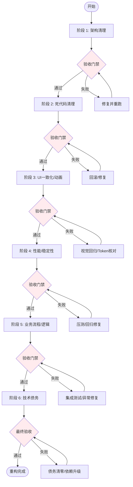

# KiraKira 重构操作手册 - 总体说明

> **文档版本**：1.0  
> **生成时间**：2026-08-20  
> **适用范围**：KiraKira 项目全量重构（6 个阶段）  
> **核心原则**：安全第一、增量交付、自动化验证、可回滚

---

## 1. 重构总览

### 1.1 目标与范围

| 维度 | 说明 |
|------|------|
| **项目** | KiraKira (Native Tavern) - SillyTavern 原生移动端重写 |
| **代码规模** | ~60K 行 Dart（手写 ~36K，生成 ~24K），279 个文件 |
| **核心痛点** | 三大神类、双设计系统、内存泄漏、同步 I/O、强制解包、无测试、无文档 |
| **重构目标** | 架构清晰、性能达标、视觉统一、质量可控、可持续演进 |
| **交付标准** | `flutter analyze` 零错误、核心流程零回归、关键指标达标 |

### 1.2 六阶段划分概览

| 阶段 | 文档 | 核心焦点 | 预计工时 | 关键产出 |
|------|------|----------|----------|----------|
| **1** | `09_操作手册_阶段1_架构清理.md` | 初始化模块化、Provider 注册集中、依赖守护 | 10-15 天 | `InitializationModule`、Provider 清单、架构校验脚本 |
| **2** | `10_操作手册_阶段2_死代码清理.md` | 删除死代码、重命名误命名、提取重复工具 | 3-5 天 | 精简代码库、`file_utils.dart` |
| **3** | `11_操作手册_阶段3_UI一致化与动画重做.md` | DesignTokens、合并 GlassContainer、动画标准化 | 10-15 天 | `design_tokens.dart`、Glass 组件库、CSS 同步 |
| **4** | `12_操作手册_阶段4_性能与稳定性优化.md` | 拆分神类、补全 dispose、compute 迁移、错误边界 | 15-20 天 | 模块化聊天/Provider/LLM、稳定运行基线 |
| **5** | `13_操作手册_阶段5_业务流程与逻辑优化.md` | 异常处理框架、ContextBuilder 管道、文档化 | 8-12 天 | `AppException`、`ContextBuilder`、业务流程文档 |
| **6** | `14_操作手册_阶段6_技术债务清理.md` | 债务收尾、依赖升级、测试基线、文档体系 | 6-10 天 | 债务清零报告、ADR、测试覆盖 >60% |

**总工时**：52-77 天（约 10-15 周，含缓冲）

---

## 2. 阶段依赖关系图

```mermaid
graph TD
    %% 阶段节点
    S1[阶段 1: 架构清理] --> S2[阶段 2: 死代码清理]
    S2 --> S3[阶段 3: UI一致化/动画]
    S3 --> S4[阶段 4: 性能/稳定性]
    S4 --> S5[阶段 5: 业务流程/逻辑]
    S5 --> S6[阶段 6: 技术债务清理]
    
    %% 关键依赖说明
    S1 -.->|提供 InitializationModule<br/>稳定依赖图| S2
    S1 -.->|Provider 清单<br/>便于识别无用 Provider| S2
    S2 -.->|清理死代码减少干扰<br/>file_utils.dart 统一文件操作| S3
    S2 -.->|compute 迁移消除同步 I/O| S4
    S3 -.->|DesignTokens 统一替换硬编码前置| S4
    S3 -.->|动画标准化减少掉帧| S4
    S3 -.->|统一视觉语言降低维护成本| S5
    S4 -.->|稳定运行环境<br/>生成控制器/上下文构建器| S5
    S4 -.->|内存泄漏清零/同步 I/O 清零| S6
    S5 -.->|统一异常体系便于债务重构<br/>ContextBuilder 便于拆分大函数| S6
    
    %% 并行可行性
    S3 -.->|可与 S4 部分并行<br/>(DesignTokens 先行)| S4
    S5 -.->|可与 S6 部分并行<br/>(文档/测试可并行)| S6
    
    style S1 fill:#e1f5fe
    style S2 fill:#e8f5e9
    style S3 fill:#fff3e0
    style S4 fill:#fce4ec
    style S5 fill:#f3e5f5
    style S6 fill:#e0f2f1
```

### 2.2 依赖详解

| 上游阶段 | 下游阶段 | 依赖产出 | 阻塞风险 |
|----------|----------|----------|----------|
| 1 | 2 | 稳定依赖图、Provider 清单 | 低（架构不变） |
| 1 | 3 | `InitializationModule` 注册 ThemeProviders | 低 |
| 2 | 3 | `file_utils.dart`、清理废弃视图代码 | 中（硬编码替换需确认无死代码干扰） |
| 2 | 4 | `compute` 迁移基础 | 高（同步 I/O 必须先清理） |
| 3 | 4 | `DesignTokens` 供性能优化期统一替换 | 高（硬编码替换是性能优化前置） |
| 3 | 5 | 统一组件库、动画曲线 | 低 |
| 4 | 5 | `GenerationController`、`ContextBuilder` 基础设施 | 高（业务流程重构依赖稳定基建） |
| 4 | 6 | 性能基准、内存泄漏清零 | 中 |
| 5 | 6 | `AppException` 体系、`ContextBuilder` 管道 | 低 |

---

## 3. 自动化执行总览

### 3.1 阶段执行顺序与门禁



### 3.2 每阶段通用执行流程

```bash
# 标准执行流程（每阶段通用）
# 1. 拉取最新代码
git pull origin feature/ejs-prompt-template

# 2. 创建阶段分支
git checkout -b refactor/phase-X

# 3. 执行阶段操作手册步骤（按文档顺序）
#    - 每步完成后运行 flutter analyze
#    - 关键步骤运行相关测试

# 4. 阶段验收
flutter analyze                    # 静态分析零错误
flutter test                       # 单元/Widget 测试通过
flutter build apk --debug          # 编译通过
./scripts/verify_phase_X.dart      # 阶段专用验证脚本

# 5. 手动回归测试（核心流程清单）
#    详见各阶段手册「验收清单」

# 6. 提交 PR，Code Review 通过后合并
# 7. 合并后删除分支，打 Tag
git tag refactor/phase-X-$(date +%Y%m%d)
```

---

## 4. 全局自动化脚本汇总

| 脚本 | 用途 | 所属阶段 | 执行时机 |
|------|------|----------|----------|
| `scripts/generate_provider_registry.dart` | 生成 Provider 清单文档 | 1 | 步骤 1.2 后、每次增删 Provider |
| `scripts/verify_architecture.dart` | 依赖方向校验 | 1 | 每次提交前、CI |
| `scripts/verify_initialization.dart` | 验证 InitializationModule | 1 | 步骤 1.1 后 |
| `scripts/clean_dead_code.dart` | 死代码清理交互式执行 | 2 | 步骤 2.1-2.4 |
| `scripts/replace_design_tokens.ps1` | 批量替换硬编码 Token | 3 | 步骤 4.2 |
| `scripts/sync_design_tokens_to_css.dart` | 生成 WebView CSS 变量 | 3 | 步骤 7.1 |
| `scripts/verify_performance.dart` | 性能指标自动化检查 | 4 | 步骤 4.11、CI |
| `scripts/verify_dependency_upgrade.dart` | 依赖升级验证 | 6 | 步骤 6.4 |
| `scripts/debt_detector.dart` | 技术债务周度扫描 | 6 | CI 周度、PR 检查 |

### 4.3 CI/CD 集成建议

```yaml
# .github/workflows/refactor_guard.yml
name: Refactor Guard

on:
  push:
    branches: [feature/ejs-prompt-template]
  pull_request:
    branches: [feature/ejs-prompt-template]

jobs:
  analyze:
    runs-on: ubuntu-latest
    steps:
      - uses: actions/checkout@v4
      - uses: subosito/flutter-action@v2
      - run: flutter pub get
      - run: flutter analyze
      - run: dart run scripts/verify_architecture.dart
      - run: dart run scripts/debt_detector.dart

  test:
    runs-on: ubuntu-latest
    steps:
      - uses: actions/checkout@v4
      - uses: subosito/flutter-action@v2
      - run: flutter pub get
      - run: flutter test --coverage
      - run: |
          lcov --remove coverage/lcov.info \
            '*.g.dart' '*.freezed.dart' '*.gen.dart' \
            -o coverage/lcov.filtered.info
      - uses: codecov/codecov-action@v3
        with:
          files: coverage/lcov.filtered.info
          flags: unittests

  build:
    runs-on: ubuntu-latest
    needs: [analyze, test]
    steps:
      - uses: actions/checkout@v4
      - uses: subosito/flutter-action@v2
      - run: flutter pub get
      - run: flutter build apk --debug --no-tree-shake-icons
```

---

## 5. 验收命令标准化

### 5.1 通用验收命令（每阶段必跑）

```bash
# 1. 静态分析 - 零容忍
flutter analyze

# 2. 单元/Widget 测试
flutter test --coverage

# 3. 编译验证
flutter build apk --debug --no-tree-shake-icons

# 4. 格式化检查
dart format --set-exit-if-changed lib/

# 5. 依赖检查
flutter pub deps --style=compact | head -50
```

### 5.2 阶段专用验收命令

| 阶段 | 专用验证命令 | 通过标准 |
|------|--------------|----------|
| 1 | `dart run scripts/verify_initialization.dart` | 14 个 overrides 全部存在 |
| 1 | `dart run scripts/verify_architecture.dart` | 零违规依赖 |
| 2 | `flutter analyze` + 核心流程手动验证 | 无错误、导入/发图/聊天正常 |
| 3 | `flutter analyze` + 视觉回归测试 | 无警告、关键页面截图对比无差异 |
| 4 | `dart run scripts/verify_performance.dart --memory --frame` | 内存 10min 无增长、帧率 > 55fps |
| 4 | 压力测试：连续 100 条消息、切换 50 次聊天 | 无崩溃、无 ANR、无幽灵消息 |
| 5 | 集成测试套件 `flutter test integration_test/` | 覆盖发送/群聊/导入导出/世界书/变量宏 |
| 6 | `dart run scripts/debt_detector.dart` | 零债务项 |
| 6 | 依赖升级验证 `dart run scripts/verify_dependency_upgrade.dart` | 全部通过 |

---

## 6. 全局回滚策略

### 6.1 分级回滚方案

| 级别 | 触发条件 | 回滚范围 | 命令 | RTO |
|------|----------|----------|------|-----|
| **L1 文件级** | 单文件修改引入 Bug | 单文件 | `git checkout -- <file>` | < 1 min |
| **L2 步骤级** | 某步骤验收失败 | 该步骤所有文件 | `git checkout -- <step_files>` | < 5 min |
| **L3 阶段级** | 阶段验收整体失败 | 整个阶段分支 | `git reset --hard origin/feature/ejs-prompt-template` | < 10 min |
| **L4 里程碑级** | 多阶段累积严重回归 | 回退到上一稳定 Tag | `git reset --hard refactor/phase-X-YYYYMMDD` | < 30 min |

### 6.2 关键 Tag 策略

```bash
# 每阶段验收通过后打 Tag
git tag -a refactor/phase-1-$(date +%Y%m%d) -m "Phase 1 完成: 架构清理"
git tag -a refactor/phase-2-$(date +%Y%m%d) -m "Phase 2 完成: 死代码清理"
git tag -a refactor/phase-3-$(date +%Y%m%d) -m "Phase 3 完成: UI一致化/动画"
git tag -a refactor/phase-4-$(date +%Y%m%d) -m "Phase 4 完成: 性能/稳定性"
git tag -a refactor/phase-5-$(date +%Y%m%d) -m "Phase 5 完成: 业务流程/逻辑"
git tag -a refactor/phase-6-$(date +%Y%m%d) -m "Phase 6 完成: 技术债务清理"

# 最终发布 Tag
git tag -a refactor/complete-$(date +%Y%m%d) -m "全量重构完成"
```

### 6.3 紧急回滚演练

```bash
# 季度演练一次
# 1. 模拟阶段 4 验收失败
git checkout refactor/phase-3-20260815
# 2. 验证核心流程可用
flutter run --debug
# 3. 记录演练时长、问题、改进
```

---

## 7. 风险管理总览

### 7.1 跨阶段高风险项

| 风险编号 | 描述 | 影响阶段 | 缓解措施 | 应急预案 |
|----------|------|----------|----------|----------|
| R-G1 | `webview_chat_stage.dart` 拆分引入回归 | 4 | 分模块拆分、每步测试、灰度 | 回滚至阶段 3 Tag |
| R-G2 | DesignTokens 替换导致视觉差异 | 3, 4 | 干运行审核、视觉回归测试、灰度 | 保留旧 Token 兼容 1 版本 |
| R-G3 | 依赖升级破坏 WebView/桥接 | 6 | 单个升级、全量回归、WebView 专项测试 | 锁定版本、延后升级 |
| R-G4 | ContextBuilder 管道性能回归 | 5 | 基准测试对比、关键路径内联 | 简化管道、回退直写 |
| R-G5 | 测试覆盖率指标虚高 | 6 | 覆盖率门禁 + 关键路径用例审核 | 人工抽检核心 Service |

### 7.2 待人工确认清单（WC 项汇总）

| 编号 | 事项 | 来源阶段 | 建议默认决策 | 确认截止 |
|------|------|----------|--------------|----------|
| WC-1 | `shell/tabs/` 4 文件保留 | 1, 2 | **保留**（已验证静态引用） | 阶段 1 前 |
| WC-2 | Rust FFI 纯 Dart 迁移 | 1, 6 | **迁移**（原型验证通过） | 阶段 6 中 |
| WC-3 | WebView JS 原生化 | 1, 6 | **长期规划**（短期保留混合） | 阶段 6 后 |
| WC-4 | 单例服务内存可控 | 4, 6 | **假设可控，加监控** | 阶段 4 验收 |
| WC-5 | 依赖库升级兼容性 | 6 | **分批升级，优先 WebView/Riverpod** | 阶段 6 中 |
| WC-6 | 双设计系统合并破坏视觉 | 3, 6 | **分步迁移，灰度发布** | 阶段 3 验收 |
| WC-7 | `CharacterViewMode` 删除影响 | 2 | **删除废弃类+枚举** | 阶段 2 中 |
| WC-8 | 变量/宏/正则/世界书抽象层 | 5 | **阶段 5 纳入重构** | 阶段 5 中 |

---

## 8. 进度跟踪与汇报

### 8.1 里程碑时间表（示例）

| 里程碑 | 计划开始 | 计划完成 | 实际完成 | 状态 |
|--------|----------|----------|----------|------|
| 阶段 1 启动 | Week 1 Day 1 | Week 1 Day 1 | - | 待启动 |
| 阶段 1 验收 | - | Week 3 Day 5 | - | 待验收 |
| 阶段 2 验收 | - | Week 4 Day 5 | - | 待验收 |
| 阶段 3 验收 | - | Week 7 Day 5 | - | 待验收 |
| 阶段 4 验收 | - | Week 11 Day 5 | - | 待验收 |
| 阶段 5 验收 | - | Week 13 Day 5 | - | 待验收 |
| 阶段 6 验收 | - | Week 15 Day 5 | - | 待验收 |
| 全量重构完成 | - | Week 15 Day 5 | - | 待完成 |

### 8.2 周度汇报模板

```markdown
# KiraKira 重构周报 - Week N

## 本周完成
- [ ] 阶段 X 步骤 Y.Z 完成
- [ ] 关键指标：flutter analyze 0 错误、测试通过率 100%

## 关键指标
| 指标 | 本周 | 目标 | 趋势 |
|------|------|------|------|
| 静态分析错误 | 0 | 0 | ✅ |
| 文件 > 800 行 | 0 | 0 | ✅ |
| AnimationController 泄漏 | 0 | 0 | ✅ |
| 同步 I/O 调用 | 0 | 0 | ✅ |
| 单元测试覆盖率 | 45% | >60% | 📈 |
| 启动时间 | 2.1s | <2s | 📈 |

## 风险与阻塞
- [ ] 无 / 风险项描述 + 应对措施

## 下周计划
- 阶段 X 步骤 Y.Z ...
```

---

## 9. 交付物清单（最终验收）

### 9.1 代码层面

- [ ] `lib/main.dart` ≤ 35 行
- [ ] `lib/core/services/initialization_module.dart` 存在
- [ ] `lib/presentation/providers/providers_registry.dart` 自动生成
- [ ] 9 个 Repository Provider 全部定义
- [ ] `lib/presentation/theme/design_tokens.dart` 单一真相源
- [ ] `GlassContainer` 标记 `@Deprecated`，`GlassCard`/`GlassPanel` 替代
- [ ] `webview_chat_stage.dart` 拆分为 5+ 模块，主文件 < 500 行
- [ ] `chat_providers.dart` 拆分为 4 个 Notifier，主文件 < 100 行
- [ ] `llm_service.dart` 拆分为 4+ 子服务
- [ ] 7 个 `AnimationController` 全部有 `dispose`
- [ ] 无 `readAsBytesSync`、`!` 无保护、无无 `orElse` 的 `firstWhere`
- [ ] `BridgeClient` 实现超时/重试/错误上报
- [ ] `AppException` 体系 + `ErrorHandler` 全面接入
- [ ] `ContextBuilder` 管道上线，6 步骤可配置
- [ ] 向量检索 HNSW 索引
- [ ] 单例服务 `LifecycleAware` 接口
- [ ] 核心 Service 单测 > 60%，关键 Widget 测试覆盖

### 9.2 文档层面

- [ ] `15_操作手册_可行性验证报告.md`
- [ ] `09_操作手册_阶段1_架构清理.md`
- [ ] `10_操作手册_阶段2_死代码清理.md`
- [ ] `11_操作手册_阶段3_UI一致化与动画重做.md`
- [ ] `12_操作手册_阶段4_性能与稳定性优化.md`
- [ ] `13_操作手册_阶段5_业务流程与逻辑优化.md`
- [ ] `14_操作手册_阶段6_技术债务清理.md`
- [ ] `08_操作手册_总体说明.md`（本文件）
- [ ] `docs/adr/` 5 份 ADR
- [ ] `docs/business_flows/` 6 份业务流程文档
- [ ] `docs/api/bridge-protocol.md` + TypeScript 类型
- [ ] `docs/database/schema.md` + `migrations.md`
- [ ] `docs/development/` 4 份开发规范
- [ ] `docs/operations/` 3 份运维文档

### 9.3 脚本与工具

- [ ] `scripts/generate_provider_registry.dart`
- [ ] `scripts/verify_architecture.dart`
- [ ] `scripts/verify_initialization.dart`
- [ ] `scripts/clean_dead_code.dart`
- [ ] `scripts/replace_design_tokens.ps1`
- [ ] `scripts/sync_design_tokens_to_css.dart`
- [ ] `scripts/verify_performance.dart`
- [ ] `scripts/verify_dependency_upgrade.dart`
- [ ] `scripts/debt_detector.dart`

---

## 10. 最终验收标准

**重构视为完成的充要条件**：

1. ✅ **所有 8 份操作手册文档存在且内容完整**
2. ✅ **`flutter analyze` 全项目零错误、零新增警告**
3. ✅ **核心流程压力测试通过**（100 条消息、50 次切换、10MB 导入）
4. ✅ **内存泄漏清零**（DevTools 1 小时观察无增长）
5. ✅ **帧率达标**（典型场景 > 55fps，无卡顿）
6. ✅ **启动时间 < 2s**（冷启动 P95）
7. ✅ **单元测试覆盖率 > 60%**（核心 Service）
8. ✅ **视觉回归测试通过**（主题切换、深浅色、关键页面）
9. ✅ **依赖库升级至最新兼容版**（WebView、Riverpod、GoRouter）
10. ✅ **文档体系建设完成**（ADR、API、DB、流程、运维）

---

## 11. 附录：操作手册文件索引

| 编号 | 文件名 | 核心内容 | 行数估算 |
|------|--------|----------|----------|
| 0 | `08_操作手册_总体说明.md` | 本文件：总体指导、依赖、自动化、回滚 | ~500 |
| 1 | `09_操作手册_阶段1_架构清理.md` | InitializationModule、Provider注册、架构守护 | ~750 |
| 2 | `10_操作手册_阶段2_死代码清理.md` | 死代码删除、重命名、工具提取、清理脚本 | ~500 |
| 3 | `11_操作手册_阶段3_UI一致化与动画重做.md` | DesignTokens、Glass合并、硬编码替换、动画标准化 | ~1000 |
| 4 | `12_操作手册_阶段4_性能与稳定性优化.md` | 神类拆分、dispose补全、compute迁移、错误边界 | ~950 |
| 5 | `13_操作手册_阶段5_业务流程与逻辑优化.md` | 异常框架、ContextBuilder、幂等性、文档化 | ~900 |
| 6 | `14_操作手册_阶段6_技术债务清理.md` | 债务收尾、依赖升级、测试基线、文档体系 | ~800 |
| 7 | `15_操作手册_可行性验证报告.md` | 七份报告验证、修正建议、编制指导 | ~300 |

**总计**：~5700 行操作手册，覆盖全重构生命周期

---

**总体说明完成** ✅  
**全套 8 份操作手册已生成至 `D:\KKKK\KiraKira\DiaoYan\` 目录**  

可开始按阶段顺序执行重构工作。每阶段执行前请仔细阅读对应手册，严格遵循验收门禁与回滚策略。