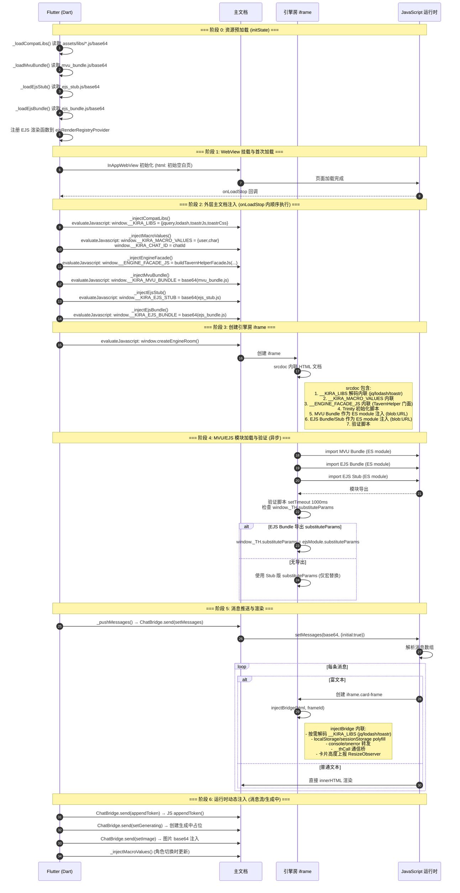

# KiraKira WebView 资源注入时序图

## 概览

本文档记录 WebView 启动过程中各类资源（第三方库、宏值、引擎房门面、MVU/EJS Bundle、兼容库）的注入时机、注入方式（静态 HTML 内联 vs 动态 Dart evaluateJavascript）、作用域（主文档 vs 引擎房 iframe）。

---

## 1. Mermaid 时序图



---

## 2. 资源注入详细时间表

| 序号 | 资源 | 注入时机 | 注入方式 | 目标作用域 | 备注 |
|------|------|----------|----------|------------|------|
| 1 | jQuery / lodash / toastr | `initState` 预加载 → `onLoadStop` → `_injectCompatLibs` | `evaluateJavascript` 设置 `window.__KIRA_LIBS` | **主文档** | 供 `injectBridge` 按需解码内联进卡片 iframe |
| 2 | `__KIRA_MACRO_VALUES` | `onLoadStop` → `_injectMacroValues` | `evaluateJavascript` 直接赋值 | **主文档** | 供 `injectBridge` 和 `substitudeMacros` 读取；角色切换时会更新 |
| 3 | `__KIRA_CHAT_ID` | `onLoadStop` → `_injectMacroValues` | 同宏值一起注入 | **主文档** | MVU/SillyTavern 兼容用 |
| 4 | TavernHelper 门面 | `onLoadStop` → `_injectEngineFacade` | `evaluateJavascript` 设置 `window.__ENGINE_FACADE_JS` | **主文档** | 字符串包含完整门面实现，`createEngineRoom` 时内联进 iframe |
| 5 | MVU Bundle | `onLoadStop` → `_injectMvuBundle` | `evaluateJavascript` 设置 `window.__KIRA_MVU_BUNDLE` (base64) | **主文档** | `createEngineRoom` 时解码为 Blob URL，作为 ES module 导入 |
| 6 | EJS Stub | `onLoadStop` → `_injectEjsStub` | `evaluateJavascript` 设置 `window.__KIRA_EJS_STUB` (base64) | **主文档** | MVU import 重写指向 stub，提供 `substituteParams` 等存根 |
| 7 | EJS Bundle | `onLoadStop` → `_injectEjsBundle` | `evaluateJavascript` 设置 `window.__KIRA_EJS_BUNDLE` (base64) | **主文档** | 真正的 EJS 编译器，`createEngineRoom` 时作为 ES module 导入 |
| 8 | 第三方库 (jq/lodash/toastr) | `createEngineRoom` → `injectBridge` (卡片创建时) | `srcdoc` 内联 `<script>decodeB64(...)</script>` | **引擎房 iframe** / **卡片 iframe** | 按需注入：检测 HTML 内容是否包含 `$`/`_`/`toastr` |
| 9 | TavernHelper 门面 | `createEngineRoom` → iframe srcdoc | `srcdoc` 内联 `<script>__ENGINE_FACADE_JS</script>` | **引擎房 iframe** | 完整门面注入引擎房，建立 `__thCall` 通信桥 |
| 10 | Trinity 对象 | `createEngineRoom` → iframe srcdoc | `srcdoc` 内联初始化脚本 | **引擎房 iframe** | `window.chat=[]`, `chat_metadata={}`, `extension_settings={}` |
| 11 | MVU Bundle (ES module) | `createEngineRoom` → iframe srcdoc | Blob URL + `<script type=module>` | **引擎房 iframe** | importmap 重写依赖路径指向 stub |
| 12 | EJS Bundle/Stub (ES module) | `createEngineRoom` → iframe srcdoc | Blob URL + `<script type=module>` | **引擎房 iframe** | 验证脚本尝试从 module 导出挂载 `substituteParams` |
| 13 | 卡片桥接脚本 | `setMessages` → `injectBridge` (每张卡片) | `srcdoc`/`Blob URL` 内联 | **卡片 iframe** | 含 polyfill、通信桥、高度上报、console 转发 |

---

## 3. 静态注入 vs 动态注入对比

### 静态注入 (HTML 字符串内联)

| 位置 | 内容 | 时机 |
|------|------|------|
| `createEngineRoom` → iframe `srcdoc` | `<script>__ENGINE_FACADE_JS</script>` | 引擎房创建时一次性 |
| `createEngineRoom` → iframe `srcdoc` | `<script>window.__KIRA_MACRO_VALUES=...</script>` | 引擎房创建时一次性 |
| `createEngineRoom` → iframe `srcdoc` | `<script>decodeB64(__KIRA_LIBS.lodash)</script>` | 引擎房创建时一次性 (按需) |
| `createEngineRoom` → iframe `srcdoc` | Trinity 初始化脚本 | 引擎房创建时一次性 |
| `injectBridge` → 卡片 iframe `srcdoc` | Polyfill + 通信桥 + 高度上报 | 每张卡片创建时 |

### 动态注入

| 方式 | 触发点 | 目标 | 内容 |
|------|--------|------|------|
| `evaluateJavascript` | `onLoadStop` / 角色切换 | **主文档** `window.__KIRA_*` | 宏值、库 base64、门面 JS、Bundle base64 |
| `evaluateJavascript` | `onLoadStop` | **主文档** `window.createEngineRoom()` | 触发引擎房创建 |
| `ChatBridge.send` | 消息流/用户操作 | **主文档** `window.__bridgeDispatch` | setMessages/appendToken/setGenerating 等 |
| `evaluateJavascript` | `_sendMessage` 前 | **主文档** 触发 MVU `generation_started` | 序列化消息 JSON |
| `createElement`/`appendChild` | `setMessages` 富文本 | **主文档** 创建卡片 iframe | `injectBridge` 生成的 HTML 注入 iframe |

---

## 4. 作用域隔离说明

```
┌─────────────────────────────────────────────────────────────┐
│  主文档 - flutter_inappwebview 加载的初始页面                │
│  ├─ window.__KIRA_LIBS          (base64 字符串)             │
│  ├─ window.__KIRA_MACRO_VALUES  (当前 user/char 名)         │
│  ├─ window.__KIRA_CHAT_ID       (chatId)                    │
│  ├─ window.__ENGINE_FACADE_JS   (TavernHelper 门面字符串)   │
│  ├─ window.__KIRA_MVU_BUNDLE    (base64)                    │
│  ├─ window.__KIRA_EJS_STUB      (base64)                    │
│  ├─ window.__KIRA_EJS_BUNDLE    (base64)                    │
│  ├─ window.__bridgeDispatch     (ChatBridge 入口)           │
│  ├─ window.__chatMessages       (MVU 同步用，_pushMessages 写入) │
│  ├─ window.__avatars            (头像 data URI)             │
│  └─ DOM: #root (消息列表容器)                               │
│       ├─ .msg-group (普通消息)                              │
│       └─ iframe.card-frame (富文本卡片) ← 独立作用域         │
└─────────────────────────────────────────────────────────────┘
                              │
                    createEngineRoom()
                              ▼
┌─────────────────────────────────────────────────────────────┐
│  引擎房 iframe (#__engineRoomHost > iframe)                 │
│  ├─ window._TH (TavernHelper 门面实例)                      │
│  ├─ window.chat / chat_metadata / extension_settings (Trinity) │
│  ├─ window.__KIRA_MACRO_VALUES (从主文档复制)               │
│  ├─ window.__KIRA_CHAT_ID (从主文档复制)                    │
│  ├─ MVU Bundle (ES module, blob:URL)                        │
│  ├─ EJS Bundle (ES module, blob:URL)                        │
│  ├─ EJS Stub (ES module, blob:URL)                          │
│  ├─ jQuery/lodash/toastr (内联 script)                      │
│  └─ 通信: parent.postMessage(__thRequest) ↔ Flutter         │
└─────────────────────────────────────────────────────────────┘
                              │
                    富文本消息创建卡片
                              ▼
┌─────────────────────────────────────────────────────────────┐
│  卡片 iframe (.card-frame)                                  │
│  ├─ injectBridge 注入的桥接脚本                             │
│  │  ├─ Polyfill (localStorage/sessionStorage/console)     │
│  │  ├─ __thCall 通信桥 (frameId 路由)                       │
│  │  ├─ 高度上报 (ResizeObserver + 定时器)                   │
│  │  └─ 按需内联 jQuery/lodash/toastr                        │
│  ├─ 卡片 HTML 内容 (m.html)                                 │
│  └─ 通信: parent.postMessage(__thRequest) → 引擎房 → Flutter│
└─────────────────────────────────────────────────────────────┘
```

---

## 5. 关键时序节点标注

| 节点 | 关键动作 | 失败表现 |
|------|----------|----------|
| T+0ms | `initState` 启动预加载 | 资源读取失败仅记录日志，不阻断 |
| T+350ms | 延迟挂载 WebView (`_webViewMounted=true`) | 避免入场动画期 WebView 重绘抢资源 |
| T+350ms~ | `onLoadStop` 顺序注入 6 项资源 | 任一注入失败仅记录，后续继续 |
| T+注入完成 | `createEngineRoom()` 创建 iframe | host 容器缺失/门面未注入会报错并回退 srcdoc |
| T+iframe load | MVU/EJS ES module 加载 | 网络/解析失败落回 srcdoc，验证脚本超时不报错 |
| T+1000ms | 验证脚本检查 `substituteParams` | 无导出则用 Stub 版(仅宏替换)，EJS 控制流失效 |
| T+消息到达 | `_pushMessages` → `setMessages` | base64 解码失败 → root 显示 ERR |

---

## 6. 已知问题与风险点

| 问题 | 影响 | 缓解/备注 |
|------|------|----------|
| **EJS Bundle 可能不导出 `substituteParams`** | 引擎房/卡片无法跑 EJS 控制流 (`<% %>)`，仅宏替换 | 验证脚本兜底挂载；Stub 版只做 `{{user}}`/`{{char}}` |
| **引擎房创建时机竞态** | `createEngineRoom` 执行时 `__ENGINE_FACADE_JS` 可能未注入完成 | Dart 侧按顺序 await 注入，JS 侧同步执行，风险低 |
| **卡片 iframe 重复注入桥接脚本** | 每张卡片都内联一份 polyfill/通信桥，体积膨胀 | 卡片数量通常 < 20，可接受；可考虑共享方案 |
| **主文档 `__chatMessages` 与引擎房 `window.chat` 双轨** | 两套消息数组需手动同步 (`chat_changed` 事件) | 当前靠 `_serializeMessagesForMvu` + `chat_changed` 事件同步 |
| **宏值更新不同步** | 角色切换/人设修改后，引擎房/卡片内的 `__KIRA_MACRO_VALUES` 可能陈旧 | `_injectMacroValues` 仅更新主文档；引擎房需重建或手动同步 |

---

*生成时间: 2026-08-19*  
*基于 `webview_chat_stage.dart` 静态分析，时序以代码顺序为准*