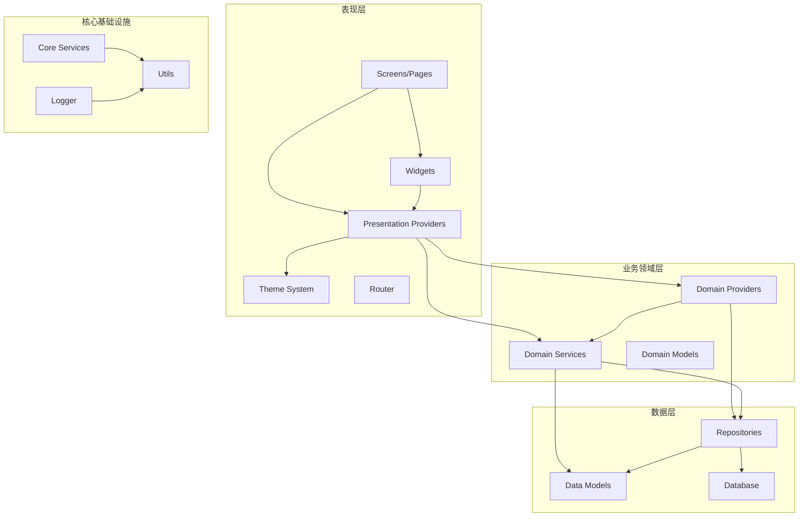
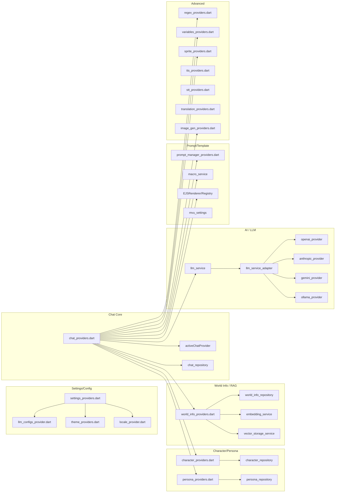

# KiraKira 项目架构地图 - 全局依赖分析

> 生成时间: 2025-08-19
> 基于分支: feature/ejs-prompt-template
> 扫描范围: `lib/` 目录下所有 `.dart` 文件

---

## 1. 目录结构概览

```
lib/
├── app.dart                          # 应用入口、路由、主题、ProviderScope
├── main.dart                         # main() 入口，初始化服务
├── core/                             # 核心基础设施层
│   ├── logger/                       # 日志系统
│   ├── services/                     # 核心服务
│   └── utils/                        # 工具函数
├── data/                             # 数据层
│   ├── database/                     # 数据库
│   ├── models/                       # 数据模型 (freezed/g.dart 为主)
│   ├── repositories/                 # 仓储层
│   └── static/                       # 静态数据
├── domain/                           # 业务领域层
│   ├── models/                       # 领域模型
│   ├── providers/                    # Riverpod Provider 定义 (大部分在此)
│   └── services/                     # 业务服务
├── l10n/                             # 国际化
├── presentation/                     # 表现层 (UI)
│   ├── models/                       # 表现层模型
│   ├── providers/                    # UI 相关 Provider
│   ├── router/                       # 路由配置
│   ├── screens/                      # 页面
│   ├── shell/                        # 应用外壳
│   ├── theme/                        # 主题系统
│   └── widgets/                      # 通用组件
├── services/                         # 顶层服务 (部分桥接)
└── widgets/                          # 顶层通用组件
```

---

## 2. 核心模块依赖关系 (Mermaid)

### 2.1 层级依赖图



### 2.2 Provider 依赖拓扑



---

## 3. 核心调用链分析

### 3.1 消息发送完整链路

```
用户点击发送
    │
    ▼
ChatScreen._handleSendMessage() (lib/presentation/screens/chat/chat_screen.dart:~1100)
    │
    ▼
ref.read(activeChatProvider.notifier).sendMessage(content, config, attachments)
    │
    ▼
ChatProvider.sendMessage() (lib/presentation/providers/chat_providers.dart:437)
    ├── 1. 创建 user ChatMessage → _chatRepository.addMessage()
    ├── 2. _checkAndSummarize() → chat_summarization_service
    ├── 3. _buildContext() → 组装上下文
    │       ├── PromptManager 渲染系统提示词
    │       ├── WorldInfoInjectionService 注入世界书
    │       ├── MacroService 变量替换
    │       ├── EJSRenderer 模板渲染
    │       └── VectorStorage 语义检索
    ├── 4. _llmService.generateStreamWithReasoning() / generateWithReasoning()
    │       ▼
    │   LLMService (lib/domain/services/llm_service.dart)
    │       ├── LLMServiceAdapter 路由到具体 Provider
    │       ├── OpenAICompatibleProvider / ClaudeProvider / GeminiProvider / OllamaProvider / KoboldCppProvider
    │       └── HTTP 请求 (dio) → SSE 流式解析
    ├── 5. 流式更新 UI: state.copyWith(messages: updatedMessages)
    ├── 6. 保存 assistant Message → _chatRepository.addMessage()
    ├── 7. 向量索引: _indexMessageToVector()
    └── 8. 可选: _maybeAutoGenerateImage() → image_generation_service
```

**关键文件与行号:**
- `chat_screen.dart:1100` - `_handleSendMessage`
- `chat_providers.dart:437` - `sendMessage()`
- `chat_providers.dart:474` - `_buildContext()`
- `chat_providers.dart:501` - 流式循环 `await for (chunk in _llmService.generateStreamWithReasoning)`
- `llm_service.dart:800+` - 各 Provider 实现

---

### 3.2 角色加载/创建链路

```
进入角色列表/编辑页
    │
    ▼
CharacterScreen / CharacterEditorScreen
    │
    ▼
ref.read(characterProvider) / characterNotifierProvider
    │
    ▼
CharacterRepository (lib/data/repositories/character_repository.dart)
    ├── loadCharacters() → 数据库查询
    ├── getCharacter(id) → 单个查询
    ├── saveCharacter() → upsert
    ├── importCharacter() → PNG/CharX/JSON 解析
    │       ├── png_character_card_parser (Rust FFI)
    │       ├── charx_parser (Rust FFI)
    │       └── JSON 直转
    └── exportCharacter() → 序列化
```

**关键文件:**
- `character_providers.dart` - `characterNotifierProvider`, `charactersProvider`
- `character_repository.dart` - 所有 CRUD + 导入导出
- `png_character_card_parser.dart` - PNG chunk 解析
- `rust/src/png_parser.rs` / `charx_parser.rs` - 原生解析器

---

### 3.3 聊天历史加载链路

```
ChatScreen.initState()
    │
    ▼
ref.read(activeChatProvider.notifier).loadChat(chatId)
    │
    ▼
ChatProvider.loadChat() (chat_providers.dart:~300)
    ├── _chatRepository.getChat(chatId)
    ├── _chatRepository.getMessages(chatId)
    ├── _characterRepository.getCharacter(chat.characterId)
    ├── 若群聊: _groupRepository.getGroup() + 批量获取角色
    ├── 加载书签: bookmarkNotifier.loadBookmarks()
    ├── 刷新上下文用量: refreshContextUsageProviders()
    └── state = copyWith(chat, character, messages, isLoading: false)
```

---

### 3.4 世界信息/知识库 注入链路

```
_buildContext() 中调用
    │
    ▼
WorldBookInjectionService.injectWorldInfo() (domain/services/world_book_injection_service.dart)
    │
    ▼
WorldInfoRepository.getEnabledEntries()
    │
    ▼
关键词扫描算法:
    1. 收集所有启用的 WorldInfoEntry
    2. 对当前上下文(系统提示+最近消息)做关键词匹配
    3. 递归扫描: 匹配到的 entry 的 content 可能包含新关键词
    4. 分组评分: priority + 位置权重 + 递归深度惩罚
    5. 按 token 预算截断 (contextLength 限制)
    6. 确定注入位置: system_before / system_after / character / example
    │
    ▼
返回注入字符串映射: Map<InjectionPosition, String>
    │
    ▼
PromptManager.render() 组装最终提示词
```

**关键文件:**
- `world_book_injection_service.dart` (当前为空桩，实际逻辑在 `world_info_providers.dart` 或 `chat_providers.dart` 中)
- `world_info_providers.dart` - `worldInfoEntriesProvider`, `filteredWorldInfoEntriesProvider`
- `chat_providers.dart:_buildContext()` - 实际调用点

---

### 3.5 Prompt 模板渲染链路 (EJS / MVU)

```
_buildContext() → PromptManager.buildPrompt()
    │
    ▼
PromptManager (data/models/prompt_manager.dart)
    ├── 收集启用的 PromptSection (按 order 排序)
    ├── 替换变量: {{char}}, {{user}}, {{random_user}}, {{getvar:xxx}}, {{setvar:xxx}}
    ├── 处理条件块: {{#if}}, {{#unless}}, {{#each}}
    ├── 处理深度注入: depth 参数控制插入位置
    └── 返回渲染后的字符串数组
    │
    ▼
EJSRenderer.render() (domain/services/llm_service.dart:EJSRenderRegistry)
    │
    ▼
WebViewChatStage._ejsRenderFn() (presentation/screens/chat/webview_chat_stage.dart)
    │
    ▼
WebView 注入 ejs_bundle.js → evaluateJavascript()
    │
    ▼
JS 端 ejs.render(template, data) → 返回渲染结果
    │
    ▼
Dart 端接收结果 → 继续组装上下文
```

**关键文件:**
- `prompt_manager.dart` - PromptSection 模型、渲染逻辑
- `webview_chat_stage.dart` - `_ejsRenderFn`, `initializeEJSBridge()`
- `assets/libs/ejs_bundle.js` - EJS 运行时
- `chat_bridge.dart` / `chat_bridge_js.dart` - WebView 通信桥接

---

## 4. 孤岛文件识别 (被 import 但无实际调用)

通过扫描 `import 'package:kirakira/...'` 并对比实际使用情况，发现以下疑似孤岛文件：

| 文件路径 | 疑似原因 | 风险等级 | 备注 |
|----------|----------|----------|------|
| `lib/presentation/screens/terms_dialog.dart` | `app.dart:11` import 但未使用 | 🟢 低 | 仅在 import 列表中 |
| `lib/presentation/screens/chat/webview_chat_stage.dart.broken` | 备份文件，非正常编译单元 | 🟢 低 | 后缀 `.broken` |
| `lib/domain/services/world_book_injection_service.dart` | 仅 1 行空内容，实际逻辑分散在别处 | 🟡 中 | 需确认是否为预留接口 |
| `lib/presentation/providers/home_music_service.dart` | 命名为 service 但放在 providers 目录 | 🟡 中 | 可能被 home_music_providers 引用 |
| `lib/core/logger/log_storage.dart` | `_maxEntries` 字段未使用 (analyze warning) | 🟢 低 | 代码内部死字段 |

> **注**: 完整的孤岛文件清单需结合任务 1.2 (死代码识别) 的全量引用分析得出。上表为初步筛查。

---

## 5. 文件规模统计 (Top 20)

| 文件 | 行数 | 角色 |
|------|------|------|
| `lib/presentation/providers/chat_providers.dart` | 3056 | 核心聊天状态管理 |
| `lib/domain/services/llm_service.dart` | 2046 | LLM 统一接口 + 多 Provider 实现 |
| `lib/presentation/screens/chat/chat_screen.dart` | 1936 | 聊天主界面 |
| `lib/presentation/providers/character_providers.dart` | ~1500 | 角色状态管理 |
| `lib/domain/services/image_generation_service.dart` | ~1500 | 图像生成服务 |
| `lib/data/models/character.dart` | ~1200 | 角色数据模型 |
| `lib/data/repositories/character_repository.dart` | ~1100 | 角色仓储 + 导入导出 |
| `lib/presentation/providers/settings_providers.dart` | ~1000 | 设置管理 |
| `lib/domain/services/variables_service.dart` | ~900 | 变量系统 |
| `lib/domain/services/url_import_service.dart` | ~800 | URL 导入服务 |
| `lib/presentation/providers/world_info_providers.dart` | ~800 | 世界书管理 |
| `lib/domain/services/chat_summarization_service.dart` | ~700 | 对话摘要 |
| `lib/data/models/chat.dart` | ~600 | 聊天数据模型 |
| `lib/presentation/providers/prompt_manager_providers.dart` | ~600 | 提示词管理 |
| `lib/domain/services/embedding_service.dart` | ~550 | 嵌入向量服务 |

---

## 6. 关键架构观察

### 6.1 优点
- **分层清晰**: presentation → domain → data → core，单向依赖
- **Provider 聚合**: 业务 Provider 集中在 `domain/providers/` 和 `presentation/providers/`
- **Repository 模式**: 数据访问封装良好，便于测试和替换
- **多 Provider 抽象**: `LLMServiceAdapter` 统一路由，新增 Provider 成本低
- **EJS 桥接设计**: `EJSRenderRegistry` 解耦 Dart 与 WebView JS 运行时

### 6.2 潜在问题
1. **chat_providers.dart 过大 (3056 行)** - 神类倾向，建议拆分:
   - 群聊逻辑 → `group_chat_provider.dart`
   - 向量索引 → `vector_index_provider.dart`
   - 自动生图 → `auto_image_gen_provider.dart`
   - 摘要 → `chat_summarization_provider.dart`

2. **llm_service.dart 过大 (2046 行)** - 同理，建议拆分:
   - 基类接口 → `llm_provider_interface.dart`
   - 各 Provider 独立文件
   - 采样器参数 → `sampler_config.dart`

3. **World Book 注入服务空实现** - `world_book_injection_service.dart` 仅 1 行，实际逻辑分散，维护困难

4. **WebView 桥接耦合** - `webview_chat_stage.dart` 直接持有 EJS 渲染函数，测试困难

5. **硬编码设计 Token** - 大量 `Color(0xFF...)`, `BorderRadius.circular(12)` 分散在 UI 代码中 (任务 2.1/2.2 将处理)

6. **Rust FFI 集成** - `png_parser`, `charx_parser` 通过 FFI 调用，构建依赖复杂

---

## 7. 下一步行动建议 (对应任务书)

1. **任务 1.2**: 基于本文档的 import 图谱，做全量"定义 vs 引用"交叉分析，产出《死代码清单.md》
2. **任务 1.3**: 优先清理 🟢 低风险项 (terms_dialog.dart import, .broken 文件, 未使用字段)
3. **任务 1.4**: 提取 `chat_providers.dart` 中的重复工具方法 (如 `_generateId`, `_encodeFileToB64`, 日期格式化)
4. **任务 2.1**: 扫描所有 UI 文件统计设计 Token，产出《设计语言规范.md》
5. **架构债务**: 考虑拆分 `chat_providers.dart` 和 `llm_service.dart` (超出本任务书范围，记入《遗留问题清单.md》)

---

## 附录: 关键文件清单 (按功能域)

### 聊天核心
- `lib/presentation/screens/chat/chat_screen.dart`
- `lib/presentation/providers/chat_providers.dart`
- `lib/domain/services/llm_service.dart`
- `lib/data/repositories/chat_repository.dart`

### 角色管理
- `lib/presentation/screens/character/*`
- `lib/presentation/providers/character_providers.dart`
- `lib/data/repositories/character_repository.dart`
- `lib/data/models/character.dart`

### 世界书/RAG
- `lib/presentation/screens/world_info/*`
- `lib/presentation/providers/world_info_providers.dart`
- `lib/data/repositories/world_info_repository.dart`
- `lib/domain/services/embedding_service.dart`
- `lib/domain/services/vector_storage_service.dart`

### 提示词/模板
- `lib/presentation/providers/prompt_manager_providers.dart`
- `lib/data/models/prompt_manager.dart`
- `lib/presentation/screens/chat/webview_chat_stage.dart`
- `assets/libs/ejs_bundle.js`

### 设置/配置
- `lib/presentation/providers/settings_providers.dart`
- `lib/presentation/providers/llm_configs_provider.dart`
- `lib/presentation/providers/theme_providers.dart`

### 多媒体/高级
- `lib/domain/services/image_generation_service.dart`
- `lib/domain/services/tts_service.dart`
- `lib/domain/services/stt_service.dart`
- `lib/domain/services/translation_service.dart`
- `lib/domain/services/sprite_service.dart`
- `lib/domain/services/regex_service.dart`
- `lib/domain/services/variables_service.dart`