# KiraKira 核心模块调用关系图

## 概览

本文档记录 KiraKira 项目核心模块之间的实际调用路径、注册但未调用的接口、以及疑似死代码。

---

## 1. Mermaid 调用流程图

```mermaid
flowchart TD
    %% ===== 用户交互层 =====
    User[用户输入] --> ChatScreen[chat_screen.dart]
    ChatScreen --> WebViewChatStage[webview_chat_stage.dart]
    
    %% ===== WebViewChatStage 核心流程 =====
    WebViewChatStage -->|initState| LoadLibs[_loadCompatLibs/_loadMvuBundle/_loadEjsStub/_loadEjsBundle]
    WebViewChatStage -->|initState| RegisterEJS[注册 EJS 渲染函数到 ejsRenderRegistryProvider]
    WebViewChatStage -->|onLoadStop| InjectLibs[_injectCompatLibs]
    WebViewChatStage -->|onLoadStop| InjectMacros[_injectMacroValues]
    WebViewChatStage -->|onLoadStop| InjectFacade[_injectEngineFacade]
    WebViewChatStage -->|onLoadStop| InjectMVU[_injectMvuBundle]
    WebViewChatStage -->|onLoadStop| InjectEJSBundle[_injectEjsBundle]
    WebViewChatStage -->|onLoadStop| CreateEngineRoom[createEngineRoom]
    WebViewChatStage -->|onLoadStop| PushMessages[_pushMessages]
    WebViewChatStage -->|onLoadStop| FireChatChanged[触发 chat_changed 事件]
    
    %% ===== 消息推送流程 =====
    PushMessages --> SerializeMsg[_serializeMessage]
    SerializeMsg --> RegexService[RegexService.getRegexedString]
    SerializeMsg --> Markdown[markdownToHtml]
    SerializeMsg --> Attachments[_buildAttachmentsHtml]
    PushMessages --> BridgeSend[ChatBridge.send setMessages]
    
    %% ===== ChatBridge 通信总线 =====
    BridgeSend -->|evaluateJavascript| JS_Dispatch[window.__bridgeDispatch]
    JS_Dispatch --> JS_setMessages[JS setMessages 函数]
    JS_setMessages -->|iframe 卡片| InjectBridge[injectBridge]
    JS_setMessages -->|普通消息| DOM_Append[DOM appendChild]
    
    %% ===== 发送消息流程 =====
    WebViewChatStage -->|_sendMessage| ActiveChatNotifier[activeChatProvider.notifier.sendMessage]
    ActiveChatNotifier -->|添加用户消息| ChatRepository[chatRepository.addMessage]
    ActiveChatNotifier -->|_buildContext| BuildContext[_buildContext]
    BuildContext --> PromptManager[PromptManager 配置]
    BuildContext --> WorldInfo[WorldInfoMatcher]
    BuildContext --> MacroService[MacroService.process]
    BuildContext --> VariablesService[VariablesService]
    BuildContext --> RAG[VectorStorageService]
    BuildContext --> Summarization[ChatSummarizationService]
    ActiveChatNotifier -->|LLMService.generateStreamWithReasoning| LLMService
    
    %% ===== LLMService EJS 渲染 =====
    LLMService -->|_renderEJSInMessages| EJSRenderer[RegistryEJSRenderer]
    EJSRenderer -->|ejsRenderRegistry.current| WebViewChatStage_Lambda[WebViewChatStage._handleRenderEJS]
    WebViewChatStage_Lambda -->|ChatBridge.onRequest th_renderEJS| JS_SubstituteParams[window._TH.substituteParams]
    
    %% ===== MVU / 引擎房 =====
    CreateEngineRoom -->|iframe srcdoc| EngineRoom[引擎房 iframe]
    EngineRoom -->|内联| FacadeJS[__ENGINE_FACADE_JS]
    EngineRoom -->|内联| MVUBundle[__KIRA_MVU_BUNDLE]
    EngineRoom -->|内联| EJSBundle[__KIRA_EJS_BUNDLE]
    EngineRoom -->|内联| EJSStub[__KIRA_EJS_STUB]
    EngineRoom -->|内联| Libs[__KIRA_LIBS]
    EngineRoom -->|初始化| Trinity[Trinity: chat/chat_metadata/extension_settings]
    
    %% ===== 酒馆助手门面 =====
    FacadeJS --> TavernHelper[TavernHelper 门面]
    TavernHelper -->|__thCall| ChatBridge[ChatBridge 请求-响应]
    TavernHelper -->|事件总线| EventBus[_TH.eventEmit/On]
    TavernHelper -->|substituteParams| MacroSub[substitudeMacros]
    TavernHelper -->|SillyTavern 兼容| ST_Context[SillyTavern.getContext]
    
    %% ===== 注册但未调用/死代码 (虚线/红色) =====
    %% 以下为虚线标注的注册但未实际调用的路径
    ChatBridge -.->|onRequest th_wiGetLorebookSettings| WiSettings[世界书设置 API]
    ChatBridge -.->|onRequest th_wiSetLorebookSettings| WiSettings
    ChatBridge -.->|onRequest th_wiCreateBook| WiCreateBook[创建世界书 API]
    
    %% injectBridge 内的死代码 (红色)
    InjectBridge -.->|_TH.getLorebookEntries| DeadCode1[死代码: 世界书查询已迁移到 facade]
    InjectBridge -.->|_TH.getEnabledLorebookList| DeadCode2[死代码]
    InjectBridge -.->|_TH.getCharacterLorebooks| DeadCode3[死代码]
    InjectBridge -.->|_TH.getLorebooks| DeadCode4[死代码]
    InjectBridge -.->|_TH.getLorebookSettings| DeadCode5[死代码]
    InjectBridge -.->|_TH.setLorebookSettings| DeadCode6[死代码]
    InjectBridge -.->|_TH.createLorebook| DeadCode7[死代码]
    
    %% MVU bundle 中的存根
    MVUBundle -.->|generate 空桩| MVU_Generate[假实现: generate 返回空字符串]
    EJSStub -.->|getRegexedString 原样返回| Stub_Regex[假实现: 正则引擎未接入]
    EJSStub -.->|loadWorldInfo null| Stub_WI[假实现: 世界书未接入]
    EJSStub -.->|yaml load/dump 空对象| Stub_YAML[假实现: 变量 YAML 未接入]
    
    %% 问候语渲染缺失 EJS (红色)
    CreateChat[createChat] -->|MacroService.process| Greeting[开场白仅宏替换]
    Greeting -.->|无 EJS 渲染| MissingEJS[🔴 缺失: 开场白不走 EJS 渲染链路]
    
    %% 样式
    classDef solid stroke:#333,stroke-width:2px;
    classDef dashed stroke:#999,stroke-width:1px,stroke-dasharray: 5 5;
    classDef dead stroke:#f00,stroke-width:2px,color:#f00;
    classDef fake stroke:#ffa500,stroke-width:2px,color:#ffa500;
    
    class User,ChatScreen,WebViewChatStage,LoadLibs,RegisterEJS,InjectLibs,InjectMacros,InjectFacade,InjectMVU,InjectEJSBundle,CreateEngineRoom,PushMessages,SerializeMsg,RegexService,Markdown,Attachments,BridgeSend,JS_Dispatch,JS_setMessages,InjectBridge,DOM_Append,ActiveChatNotifier,ChatRepository,BuildContext,PromptManager,WorldInfo,MacroService,VariablesService,RAG,Summarization,LLMService,EJSRenderer,WebViewChatStage_Lambda,JS_SubstituteParams,EngineRoom,FacadeJS,MVUBundle,EJSBundle,EJSStub,Libs,Trinity,TavernHelper,ChatBridge,EventBus,MacroSub,ST_Context solid;
    class ChatBridge,WiSettings,WiCreateBook dashed;
    class DeadCode1,DeadCode2,DeadCode3,DeadCode4,DeadCode5,DeadCode6,DeadCode7,MissingEJS dead;
    class MVU_Generate,Stub_Regex,Stub_WI,Stub_YAML fake;
```



---

## 2. 核心模块依赖关系表

| 模块 | 依赖方向 | 调用方式 | 说明 |
|------|---------|----------|------|
| `webview_chat_stage.dart` | → `chat_providers.dart` | `ref.read(activeChatProvider.notifier).sendMessage()` | 发送消息入口 |
| `webview_chat_stage.dart` | → `llm_service.dart` | 通过 `ejsRenderRegistryProvider` 反向注入 `_handleRenderEJS` | EJS 渲染桥 |
| `webview_chat_stage.dart` | → `tavern_helper_facade.dart` | `buildTavernHelperFacadeJs()` 生成 JS 字符串 | 引擎房门面 |
| `chat_providers.dart` | → `llm_service.dart` | `_llmService.generateStreamWithReasoning(context, config)` | LLM 调用 |
| `chat_providers.dart` | → `macro_service.dart` | `MacroService(macroContext).process(text)` | 宏替换 |
| `chat_providers.dart` | → `variables_service.dart` | `VariablesService.instance.processVariableMacros()` | 变量宏 |
| `chat_providers.dart` | → `regex_service.dart` | `RegexService.getRegexedString()` | 正则脚本 |
| `chat_providers.dart` | → `world_info_injection_service.dart` | `_worldInfoMatcher.groupByPosition()` | 世界书注入 |
| `llm_service.dart` | → `ejs_render_registry.dart` | `RegistryEJSRenderer(_registry).render()` | EJS 渲染抽象 |
| `chat_bridge.dart` | ↔ `webview_chat_stage.dart` | `on/onRequest/send` | 统一通信总线 |

---

## 3. 关键偏差：设计意图 vs 实际实现

| 设计意图 | 实际实现 | 偏离原因 |
|---------|---------|---------|
| **Trinity (chat/chat_metadata/extension_settings) 应在引擎房初始化时建立** | 在 `createEngineRoom` 内联脚本中通过 `window.chat = []` 等临时初始化 | MVU 启动依赖这些全局对象，但实际数据同步靠 `chat_changed` 事件补 |
| **EJS 渲染应统一走引擎房 `substituteParams`** | 只有发送给 LLM 的消息走 `_renderEJSInMessages` → `_handleRenderEJS`；开场白、历史消息展示**完全跳过 EJS** | 历史包袱：`_serializeMessage` 只做正则+Markdown，未接 EJS |
| **世界书 API 应统一在 TavernHelper 门面** | `injectBridge` 内仍保留旧版 `_TH.getLorebookEntries` 等定义（已标记死代码注释） | 迁移未彻底清理，双套 API 并存 |
| **MVU `generate` 应提供完整实现** | `tavern_helper_facade.dart` 中 `generate` 为空桩，返回 `Promise.resolve("")` | 标注 "真实现押后"，当前 MVU 额外模型走 `generateRaw` 绕过 |
| **正则脚本应在 EJS 前跑** | `injectBridge` 中 `getRegexedString` 为存根原样返回；Dart 侧 `_serializeMessage` 已跑过正则 | 双轨制：Dart 侧跑正则给展示层，JS 侧存根给 MVU/EJS |

---

## 4. 实线/虚线/红色标注说明

- **实线 (solid)**: 运行时真实调用路径，已验证有流量
- **虚线 (dashed)**: 接口已在 `ChatBridge` 注册 (`onRequest`)，但运行期未观测到被调用
- **红色 (dead)**: 代码存在但确认不可达，或功能缺失导致的逻辑断点
- **橙色 (fake)**: 存根实现，返回默认值/空 Promise，标注 `[STUB]`/`[STUB!]`

---

## 5. 核心调用链详解

### 5.1 发送消息完整链路
```
用户点发送
  → WebViewChatStage._sendMessage()
  → ActiveChatNotifier.sendMessage(content, config)
    → 添加用户消息到状态/数据库
    → _buildContext() 构建完整上下文
      → PromptManager 按 section 组装 system/user/assistant 消息
      → WorldInfoMatcher 关键词匹配注入 world info
      → MacroService.process() 宏替换 {{user}}/{{char}} 等
      → VariablesService 变量宏 {{getvar}}/{{setvar}}
      → RAG 向量检索注入
      → ChatSummarizationService 摘要注入
    → LLMService.generateStreamWithReasoning(context, config)
      → _renderEJSInMessages() 对每条 content 调 EJSRenderer
        → RegistryEJSRenderer.render() → ejsRenderRegistry.current (WebViewChatStage._handleRenderEJS)
          → ChatBridge.send(th_renderEJS) → JS window._TH.substituteParams()
      → 具体 Provider (OpenAI/Claude/Gemini...) 发请求
    → 流式接收 token → 更新 assistantMessage.content → 状态刷新 → WebView appendToken
```

### 5.2 消息展示完整链路
```
ActiveChatProvider.messages 变化
  → WebViewChatStage ref.listen 触发
    → _pushMessages() / _appendNewMessages()
      → _serializeMessage() 序列化单条消息
        → RegexService.getRegexedString() 正则脚本处理
        → markdownToHtml() Markdown 转 HTML
        → _buildAttachmentsHtml() 附件 HTML
      → base64 编码 → ChatBridge.send(setMessages)
        → JS setMessages(b64, options)
          → 解析 base64 → 遍历数组创建 DOM
            → 富文本检测 isRichHtml() → iframe 卡片 或 普通 div
            → iframe 走 injectBridge() 内联库+桥接脚本
          → root.appendChild()
```

### 5.3 引擎房初始化链路
```
WebView onLoadStop
  → _injectCompatLibs() → window.__KIRA_LIBS
  → _injectMacroValues() → window.__KIRA_MACRO_VALUES
  → _injectEngineFacade() → window.__ENGINE_FACADE_JS (tavern_helper_facade)
  → _injectMvuBundle() → window.__KIRA_MVU_BUNDLE
  → _injectEjsStub() → window.__KIRA_EJS_STUB
  → _injectEjsBundle() → window.__KIRA_EJS_BUNDLE
  → evaluateJavascript: window.createEngineRoom()
    → 创建 iframe#__engineRoomHost
    → srcdoc 内联所有上述资源
    → Trinity 初始化: window.chat/chat_metadata/extension_settings
    → MVU bundle 作为 ES module 注入 (importmap 重写路径指向 stub)
    → EJS bundle/stub 注入
    → 验证脚本检查 window._TH.substituteParams
```

---

## 6. 待确认的调用路径

| 路径 | 状态 | 备注 |
|------|------|------|
| `ChatBridge.onRequest('th_triggerSlash')` | 未观测到调用 | Slash 命令可能走别的路径 |
| `ChatBridge.onRequest('th_setInput')` | 未观测到调用 | 输入框设置可能未用 |
| `ChatBridge.onRequest('th_setMessage')` | 未观测到调用 | 消息编辑可能走别的路径 |
| `WebViewChatStage._handleGetMessages` | 已注册 | MVU 可能通过 `getChatMessages` 调用 |
| `WebViewChatStage._handleSetMessages` | 已注册 | MVU 可能通过 `setChatMessages` 调用 |

---

*生成时间: 2026-08-19*  
*基于代码静态分析，运行时动态验证请结合日志*